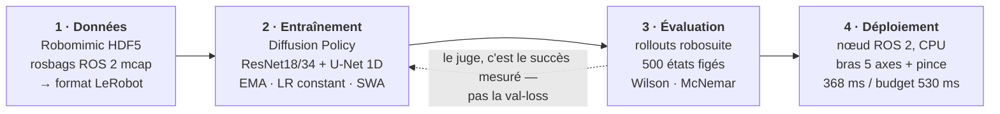

# Apprendre à un bras robotique à saisir un objet

**De la simulation au matériel réel — en mesurant chaque étape.**

Projet mené seul sur 5 mois : ~45 000 lignes de Python, 186 modèles entraînés,
des tâches simulées jusqu'à un bras 5 axes physique.

<!-- TROU 1 : bandeau d'accroche.
     Idéal = 3 vidéos côte à côte (simulation / robot réel / échec analysé).
     Il manque une vidéo du ROBOT RÉEL — à filmer et déposer dans docs/assets/. -->

| Robomimic Can — saisie réussie | Même départ, avec et sans occlusion | Échec analysé image par image |
|:---:|:---:|:---:|
|  |  |  |
| vision pure, sans coordonnées de l'objet | à gauche il réussit, à droite il part à vide | la pince se referme 4 cm trop haut |

---

## Les tâches, du plus simple au plus dur

| PushT (2D) | Robomimic Can — 1 caméra | Robomimic Can — 2 caméras |
|:---:|:---:|:---:|
|  |  |  |
| pousser un T sur une cible | agentview seule — **70,4 %** | + vue de dessus — **74,8 %** |
| *là où j'ai découvert que la loss ment* | *bras Panda 7 axes, 500 rollouts* | *les deux vues que voit le réseau* |

<!-- TROU 1b : il manque un GIF de **Lift** (la tâche résolue à 100 %).
     Aucun checkpoint ni vidéo Lift n'a survécu aux purges de disque — il faudrait
     réentraîner un modèle (~1 h) puis filmer un rollout avec le harnais d'éval. -->

---

## Ce que j'ai construit

**Un pipeline complet, de la donnée au robot.** Conversion de démonstrations
(HDF5 Robomimic et rosbags ROS 2 `mcap`) vers le format LeRobot, entraînement de
Diffusion Policies, évaluation par rollouts en simulation, déploiement sur un bras réel
via un nœud ROS 2.

**Un protocole d'évaluation que je peux défendre.** 500 rollouts avec intervalles de
Wilson, comparaisons appariées par test de McNemar, états initiaux figés, contrôles
systématiques. Parce qu'une mesure sur 50 épisodes a un intervalle de ±13 points — soit
plus large que la plupart des écarts qu'on cherche à démontrer.

**Des résultats négatifs documentés.** Cinq pistes invalidées par la mesure sur le seul
dernier chantier. C'est la partie du dépôt dont je suis le plus satisfait.

---

## Quelques chiffres

| | |
|---|---|
| Robomimic Lift, Diffusion Policy | **100 %** de réussite |
| Compression du même modèle | **÷160 paramètres, ÷21 latence**, 98,6 % conservés ÷9 seulement en vision pure — le facteur 160 tient à une béquille |
| Robomimic Can, vision pure (sans coordonnées de l'objet) | **94,8 %** sur 500 rollouts |
| Robot réel, premier contrôle autonome | **5 réussites sur 14 essais** |
| Coût mesuré d'une occlusion de la cible | **−16,7 points** (p = 0,002) |

<!-- TROU 2 : une photo du robot réel avec la pomme. C'est le visuel qui ancre
     le projet dans le concret — actuellement absent du dépôt. -->

---

## Le robot réel

Bras 5 axes + pince, tâche de préhension d'objet à position variable, dataset construit
à partir de rosbags ROS 2 (79 épisodes, 24 681 frames, 2 caméras).

Le modèle déployé est une Diffusion Policy de 263 M de paramètres tournant **sur CPU**,
avec une latence de 368 ms au banc pour un budget de 530 ms.

**Ce qui marche** : le robot mène la pomme jusqu'à la cible en autonomie.
**Ce qui reste** : il échoue une fois sur deux, et j'ai passé trois jours à mesurer pourquoi.

<!-- TROU 3 : vidéo d'un rollout autonome réussi sur le vrai robot.
     À filmer. C'est probablement le contenu le plus convaincant du portfolio. -->

---

## Pourquoi ce modèle, et pas un autre

Chaque choix d'architecture ci-dessous a été **mesuré**, pas supposé. Les chiffres sont des
taux de réussite sur rollouts, à états initiaux figés, avec leur intervalle de confiance.

### Une seule caméra fixe — et surtout pas de caméra au poignet

C'est le résultat qui m'a le plus surpris, parce qu'il va contre l'intuition : **ajouter une
caméra dégrade le modèle.** Deux entraînements identiques, une seule différence — B reçoit en
plus le flux de la caméra embarquée dans la pince, avec son propre encodeur.

| configuration | A · agentview seule | B · + caméra poignet | écart |
|---|---:|---:|---:|
| 96 px, ResNet34, U-Net [128,256,512] | **67,4 %** | 42,0 % | −25,4 |
| 224 px + augmentation | **72,4 %** | 35,2 % | −37,2 |
| 84 px, U-Net [512,1024,2048], 196 démos | **96,0 %** | 34,6 % | −61,4 |

500 rollouts par cellule. Les trois lignes ne sont pas comparables entre elles (résolution,
capacité et budget diffèrent) ; à l'intérieur d'une ligne, A et B sont appariés.

La dernière ligne mérite une note d'humilité : ce n'est pas une de mes configurations, c'est la
**recette standard publiée** pour Diffusion Policy sur Robomimic — 84 px avec crop aléatoire, gros
U-Net, 196 démonstrations, entraînement long. Elle atteint 96 % là où mes variantes maison
plafonnaient entre 67 et 81 %. Savoir reproduire la référence avant de l'améliorer m'aurait fait
gagner plusieurs semaines.

Trois capacités, trois résolutions, toujours le même verdict. Ce n'est donc pas un accident
d'entraînement ni un manque de capacité. L'hypothèse que je retiens : en approche, le poignet
ne voit qu'une bouillie de pixels sans repère global, et cette vue domine la décision au
moment précis où la vue d'ensemble serait utile. Le poignet reste pertinent pour la
manipulation fine au contact — pas pour aller chercher un objet.

<!-- TROU 6 : un GIF A vs B côte à côte (script prêt : experiments/can/123_video_wristcap_AB.py),
     à tourner quand la machine est libre. -->

### Un décodeur qu'on ne peut pas rétrécir, un encodeur qu'on peut

La compression ne se joue pas là où on croit. Le U-Net est déroulé dix fois par inférence :
c'est lui qui fait la latence. Mais c'est aussi lui qui porte la performance.

| ce qu'on réduit | effet mesuré |
|---|---|
| U-Net [64,128,256] → [32,64,128] | **−18 points** (p = 0,002), 150 rollouts appariés |
| U-Net [32,64,128] → [16,32,64] | falaise : **2 %** de réussite |
| encodeur ResNet18 → mini-CNN 0,03 M | **aucune perte**, entraînement **÷4** plus rapide |

L'encodeur visuel était donc massivement surdimensionné, et le décodeur à peine assez grand.
C'est l'inverse de ce que j'avais supposé en commençant.

### Plus de points d'intérêt n'aide pas

Le spatial softmax résume l'image en K coordonnées. J'ai balayé K sur le banc d'occlusion :

| K | 32 (baseline) | 64 | 128 | 256 |
|---|---:|---:|---:|---:|
| réussite | 56,0 % | 64,7 % | 60,7 % | 53,3 % |
| p (McNemar) | — | 0,105 | 0,464 | — |

Aucun écart significatif, et la tendance s'inverse au-delà de 64. Sur 150 rollouts appariés,
**environ 55 épisodes basculent d'un entraînement à l'autre** : tout écart inférieur à 12 points
est simplement indétectable à cette taille d'échantillon. Savoir cela évite de conclure sur du bruit.

---

## L'enquête qui m'a le plus appris

Le robot perdait l'objet de vue quand son propre bras le masquait. J'ai voulu lui donner
une mémoire.

J'ai construit un banc reproduisant l'occlusion en simulation, mesuré son coût
(**−16,7 points**), implémenté deux mécanismes de mémoire tirés de la littérature,
balayé quatre tailles d'encodeur visuel. **Douze comparaisons, aucune concluante.**

Puis une mesure de contrôle a montré que le vrai goulot était ailleurs : même en
fournissant au modèle la position exacte de l'objet, **23 % des tentatives échouent à la
préhension** — la pince se referme 1,8 cm trop haut. Une fois l'objet saisi, tout
réussit à 95 %.

Le problème n'était pas la mémoire. Il était dans le dernier centimètre.

→ [`docs/recherche/MEMOIRE.md`](docs/recherche/MEMOIRE.md)

---

## Stack

`PyTorch 2.10` · `LeRobot 0.5` · `Diffusion Policy` (U-Net 1D, DDPM/DDIM) ·
`robosuite` / `robomimic` / `MuJoCo` · `ROS 2 jazzy` · entraînement sur MPS, CUDA et
Intel Arc (XPU)

### Le pipeline, de bout en bout

Le point important est la **boucle 3 → 2** : aucun modèle n'est retenu sur sa loss de
validation. Le juge est le taux de réussite en rollouts, parce que les deux ne sont pas
corrélés — [c'est la leçon de la phase PushT](docs/METHODOLOGIE.md).

---

## Pour aller plus loin

- [`docs/PARCOURS.md`](docs/PARCOURS.md) — le parcours détaillé phase par phase
- [`docs/recherche/MEMOIRE.md`](docs/recherche/MEMOIRE.md) — l'enquête mémoire et occlusion
- [`docs/METHODOLOGIE.md`](docs/METHODOLOGIE.md) — pourquoi la loss ment, et ce qu'il faut mesurer
- [`docs/COMPRESSION.md`](docs/COMPRESSION.md) — compression et limites du modèle
- [`docs/README.md`](docs/README.md) — index complet

<!-- TROU 5 : une ligne « qui je suis / ce que je cherche » + contact.
     Indispensable pour un portfolio de stage, à écrire ensemble. -->
