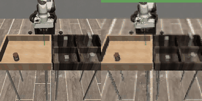
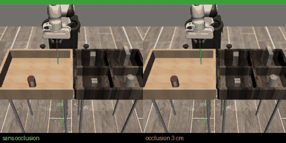
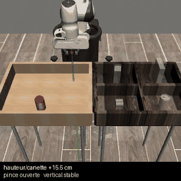
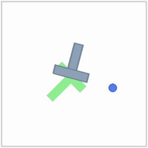
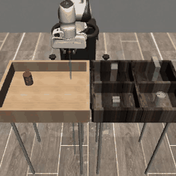
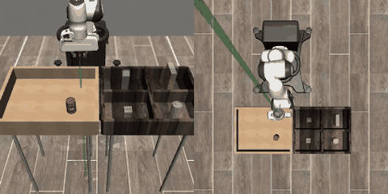

# Apprendre à un bras robotique à saisir un objet

**De la simulation au matériel réel — en mesurant chaque étape.**

Projet mené seul sur 5 mois : ~45 000 lignes de Python, 186 modèles entraînés,
des tâches simulées jusqu'à un bras 5 axes physique.

<!-- TROU 1 : bandeau d'accroche.
     Idéal = 3 vidéos côte à côte (simulation / robot réel / échec analysé).
     Il manque une vidéo du ROBOT RÉEL — à filmer et déposer dans docs/assets/. -->

| Robomimic Can — saisie réussie | Même départ, avec et sans occlusion | Échec analysé image par image |
|:---:|:---:|:---:|
|  |  |  |
| vision pure, sans coordonnées de l'objet | à gauche il réussit, à droite il part à vide | la pince se referme 4 cm trop haut |

---

## Les tâches, du plus simple au plus dur

| PushT (2D) | Robomimic Can — 1 caméra | Robomimic Can — 2 caméras |
|:---:|:---:|:---:|
|  |  |  |
| pousser un T sur une cible | agentview seule — **70,4 %** | + vue de dessus — **74,8 %** |
| *là où j'ai découvert que la loss ment* | *bras Panda 7 axes, 500 rollouts* | *les deux vues que voit le réseau* |

<!-- TROU 1b : il manque un GIF de **Lift** (la tâche résolue à 100 %).
     Aucun checkpoint ni vidéo Lift n'a survécu aux purges de disque — il faudrait
     réentraîner un modèle (~1 h) puis filmer un rollout avec le harnais d'éval. -->

---

## Ce que j'ai construit

**Un pipeline complet, de la donnée au robot.** Conversion de démonstrations
(HDF5 Robomimic et rosbags ROS 2 `mcap`) vers le format LeRobot, entraînement de
Diffusion Policies, évaluation par rollouts en simulation, déploiement sur un bras réel
via un nœud ROS 2.

**Un protocole d'évaluation que je peux défendre.** 500 rollouts avec intervalles de
Wilson, comparaisons appariées par test de McNemar, états initiaux figés, contrôles
systématiques. Parce qu'une mesure sur 50 épisodes a un intervalle de ±13 points — soit
plus large que la plupart des écarts qu'on cherche à démontrer.

**Des résultats négatifs documentés.** Cinq pistes invalidées par la mesure sur le seul
dernier chantier. C'est la partie du dépôt dont je suis le plus satisfait.

---

## Quelques chiffres

| | |
|---|---|
| Robomimic Lift, Diffusion Policy | **100 %** de réussite |
| Compression du même modèle | **÷160 paramètres, ÷21 latence**, 98,6 % conservés |
| Robomimic Can, vision pure (sans coordonnées de l'objet) | **94,8 %** sur 500 rollouts |
| Robot réel, premier contrôle autonome | **5 réussites sur 14 essais** |
| Coût mesuré d'une occlusion de la cible | **−16,7 points** (p = 0,002) |

<!-- TROU 2 : une photo du robot réel avec la pomme. C'est le visuel qui ancre
     le projet dans le concret — actuellement absent du dépôt. -->

---

## Le robot réel

Bras 5 axes + pince, tâche de préhension d'objet à position variable, dataset construit
à partir de rosbags ROS 2 (79 épisodes, 24 681 frames, 2 caméras).

Le modèle déployé est une Diffusion Policy de 263 M de paramètres tournant **sur CPU**,
avec une latence de 368 ms au banc pour un budget de 530 ms.

**Ce qui marche** : le robot mène la pomme jusqu'à la cible en autonomie.
**Ce qui reste** : il échoue une fois sur deux, et j'ai passé trois jours à mesurer pourquoi.

<!-- TROU 3 : vidéo d'un rollout autonome réussi sur le vrai robot.
     À filmer. C'est probablement le contenu le plus convaincant du portfolio. -->

---

## L'enquête qui m'a le plus appris

Le robot perdait l'objet de vue quand son propre bras le masquait. J'ai voulu lui donner
une mémoire.

J'ai construit un banc reproduisant l'occlusion en simulation, mesuré son coût
(**−16,7 points**), implémenté deux mécanismes de mémoire tirés de la littérature,
balayé quatre tailles d'encodeur visuel. **Douze comparaisons, aucune concluante.**

Puis une mesure de contrôle a montré que le vrai goulot était ailleurs : même en
fournissant au modèle la position exacte de l'objet, **23 % des tentatives échouent à la
préhension** — la pince se referme 1,8 cm trop haut. Une fois l'objet saisi, tout
réussit à 95 %.

Le problème n'était pas la mémoire. Il était dans le dernier centimètre.

→ [`docs/recherche/MEMOIRE.md`](docs/recherche/MEMOIRE.md)

---

## Stack

`PyTorch 2.10` · `LeRobot 0.5` · `Diffusion Policy` (U-Net 1D, DDPM/DDIM) ·
`robosuite` / `robomimic` / `MuJoCo` · `ROS 2 jazzy` · entraînement sur MPS, CUDA et
Intel Arc (XPU)

<!-- TROU 4 : un schéma d'architecture (donnée → entraînement → déploiement).
     Utile pour montrer la vue d'ensemble en un coup d'œil. -->

---

## Pour aller plus loin

- [`docs/PARCOURS.md`](docs/PARCOURS.md) — le parcours détaillé phase par phase
- [`docs/recherche/MEMOIRE.md`](docs/recherche/MEMOIRE.md) — l'enquête mémoire et occlusion
- [`docs/METHODOLOGIE.md`](docs/METHODOLOGIE.md) — pourquoi la loss ment, et ce qu'il faut mesurer
- [`docs/COMPRESSION.md`](docs/COMPRESSION.md) — compression et limites du modèle
- [`docs/README.md`](docs/README.md) — index complet

<!-- TROU 5 : une ligne « qui je suis / ce que je cherche » + contact.
     Indispensable pour un portfolio de stage, à écrire ensemble. -->
