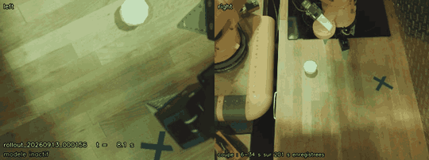
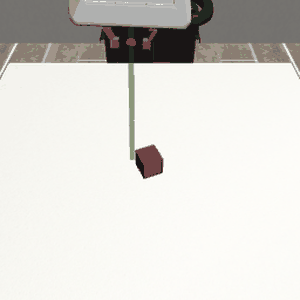
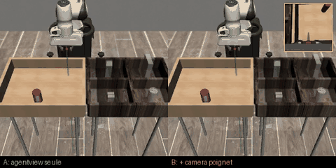
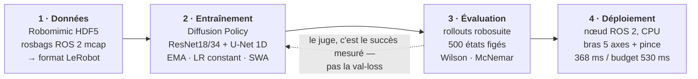

# Apprendre à un bras robotique à saisir un objet

**De la simulation au matériel réel — en mesurant chaque étape.**

Projet mené seul sur 5 mois : ~45 000 lignes de Python, 186 modèles entraînés,
des tâches simulées jusqu'à un bras 5 axes physique.

## Le robot, en autonomie

Un essai réussi du 13 septembre 2026. Les deux flux que reçoit le modèle, et l'incrustation
qui indique à chaque instant s'il pilote (<b>MODÈLE ACTIF</b>) et quelle consigne il envoie à la
pince. Il approche, referme, transporte, relâche — sans intervention.

Sur cette série : **7 réussites sur 15 essais**. Le résultat de chaque essai est relevé par
l'opérateur, jamais déduit des données — les fiches du dépôt distinguent explicitement les deux.

---

## La même tâche, en simulation

C'est là que tout se mesure : en simulation on peut rejouer mille fois le même état initial,
ce qui est impossible sur un bras physique.

| Robomimic Can — saisie réussie | Même départ, avec et sans occlusion | Échec analysé image par image |
|:---:|:---:|:---:|
|  |  |  |
| vision pure, sans coordonnées de l'objet | à gauche il réussit, à droite il part à vide | la pince se referme 4 cm trop haut |

---

## Les tâches, du plus simple au plus dur

| PushT — pousser un T sur une cible | Robomimic Lift — soulever un cube |
|:---:|:---:|
|  |  |
| *là où j'ai découvert que la loss ment* | **100 %** de réussite |

| Robomimic Can — 1 caméra | Robomimic Can — 2 caméras |
|:---:|:---:|
|  |  |
| agentview seule — **70,4 %** | + vue de dessus — **74,8 %** |

500 rollouts par mesure, états initiaux figés. Le modèle Lift filmé ici a été réentraîné
pour la démonstration (6/6 sur les épisodes filmés) ; le 100 % vient de l'évaluation d'origine.

---

## Ce que j'ai construit

**Un pipeline complet, de la donnée au robot.** Conversion de démonstrations
(HDF5 Robomimic et rosbags ROS 2 `mcap`) vers le format LeRobot, entraînement de
Diffusion Policies, évaluation par rollouts en simulation, déploiement sur un bras réel
via un nœud ROS 2.

**Un protocole d'évaluation que je peux défendre.** 500 rollouts avec intervalles de
Wilson, comparaisons appariées par test de McNemar, états initiaux figés, contrôles
systématiques. Parce qu'une mesure sur 50 épisodes a un intervalle de ±13 points — soit
plus large que la plupart des écarts qu'on cherche à démontrer.

**Des résultats négatifs documentés.** Cinq pistes invalidées par la mesure sur le seul
dernier chantier. C'est la partie du dépôt dont je suis le plus satisfait.

---

## Quelques chiffres

| | |
|---|---|
| Robomimic Lift, Diffusion Policy | **100 %** de réussite |
| Compression du même modèle | **÷160 paramètres, ÷21 latence**, 98,6 % conservés ÷9 seulement en vision pure — le facteur 160 tient à une béquille |
| Robomimic Can, vision pure (sans coordonnées de l'objet) | **94,8 %** sur 500 rollouts |
| Robot réel, contrôle autonome | **5/14** le 8 sept., puis **7/15** le 13 |
| Coût mesuré d'une occlusion de la cible | **−13,3 points** (p = 0,013) |

---

## Le robot réel

Bras 5 axes + pince, tâche de préhension d'objet à position variable, dataset construit
à partir de rosbags ROS 2 (79 épisodes, 24 681 frames, 2 caméras).

Le modèle déployé est une Diffusion Policy de 263 M de paramètres tournant **sur CPU**,
avec une latence de 368 ms au banc pour un budget de 530 ms.

**Ce qui marche** : le robot mène la pomme jusqu'à la cible en autonomie.
**Ce qui reste** : il échoue une fois sur deux, et j'ai passé trois jours à mesurer pourquoi.

## Pourquoi ce modèle, et pas un autre

Chaque choix d'architecture ci-dessous a été **mesuré**, pas supposé. Les chiffres sont des
taux de réussite sur rollouts, à états initiaux figés, avec leur intervalle de confiance.

### Une seule caméra fixe suffit — et le poignet nuit

C'est le résultat qui m'a le plus surpris, parce qu'il va contre l'intuition : **ajouter une
caméra ne fait jamais mieux, et l'embarquer dans la pince fait beaucoup plus mal.**

Pour trancher, j'ai entraîné trois modèles strictement identiques — seule la deuxième caméra
change — et je les ai évalués sur **les mêmes 500 états initiaux**, ce qui autorise un test
apparié. C'est la mesure qui manquait : les comparaisons précédentes ne sauvegardaient que les
moyennes, et leurs intervalles se chevauchaient.

| câblage | réussite (500 rollouts) | vs caméra seule |
|---|---:|---|
| **côté seule** | **76,6 %** et **80,4 %** *(deux entraînements)* | référence |
| côté + **dessus** | 80,0 % [76,3 ; 83,3] | +3,4 pts, p = 0,16 — **non significatif** |
| côté + **poignet** | 54,2 % et 61,6 % *(deux entraînements)* | **−18,8 à −22,4 pts, p < 10⁻⁷** |
| côté + poignet + dropout de caméra | 64,2 % [59,9 ; 68,3] | −16,2 pts, p = 4·10⁻⁹ |

Le détail des épisodes discordants dit mieux que les moyennes ce qui se passe. La vue de dessus
fait **gagner 72 épisodes et en perdre 55** : elle ne fait pas mieux, elle fait *différemment*,
pour un solde de 17 sur 500. Le poignet, lui, en fait perdre 142 pour 67 gagnés — ce n'est pas
du bruit, c'est une dégradation franche.

### Le plancher de bruit, et pourquoi il change tout

Deux colonnes ci-dessus portent **deux chiffres** : j'ai, par accident, entraîné deux fois la même
configuration. Les écarts obtenus sont de **+3,8 et +7,4 points** — entre des entraînements
strictement identiques, à graine égale. La non-reproductibilité vient du chargement de données
multi-processus et du GPU.

Le test de McNemar déclare pourtant le second « significatif » (p = 0,0007). Ce n'est pas une
erreur du test : **McNemar compare deux modèles, pas deux configurations.** Avec une seule graine
par condition, il ne peut pas distinguer l'effet d'un réglage du hasard d'un entraînement.

Conséquence que je tire pour ce dépôt : **tout écart inférieur à ~8 points sur 500 rollouts
demande plusieurs graines avant d'être annoncé.** Les résultats ci-dessus qui survivent à ce
critère sont le coût de la caméra de poignet (−18,8 à −22,4) et l'absence d'effet démontrable
de la deuxième caméra extérieure. Les autres sont des pistes, pas des conclusions.

C'est une leçon que j'ai apprise en me trompant : j'avais d'abord attribué ces 7,4 points à
la correction d'un défaut de normalisation, avant de découvrir que LeRobot écrase les statistiques
d'image du dataset par celles d'ImageNet (`use_imagenet_stats=True`) — ce que je croyais corriger
n'était donc jamais lu.

Le même verdict sur le poignet ressort de trois autres configurations, à des capacités et des
résolutions différentes :

| configuration | A · agentview seule | B · + caméra poignet | écart |
|---|---:|---:|---:|

| configuration | A · agentview seule | B · + caméra poignet | écart |
|---|---:|---:|---:|
| 96 px, ResNet34, U-Net [128,256,512] | **67,4 %** | 42,0 % | −25,4 |
| 224 px + augmentation | **72,4 %** | 35,2 % | −37,2 |
| 84 px, U-Net [512,1024,2048], 196 démos | **96,0 %** | 34,6 % | −61,4 |

500 rollouts par cellule. Les trois lignes ne sont pas comparables entre elles (résolution,
capacité et budget diffèrent) ; à l'intérieur d'une ligne, A et B sont appariés.

La dernière ligne mérite une note d'humilité : ce n'est pas une de mes configurations, c'est la
**recette standard publiée** pour Diffusion Policy sur Robomimic — 84 px avec crop aléatoire, gros
U-Net, 196 démonstrations, entraînement long. Elle atteint 96 % là où mes variantes maison
plafonnaient entre 67 et 81 %. Savoir reproduire la référence avant de l'améliorer m'aurait fait
gagner plusieurs semaines.

Quatre capacités, quatre résolutions, toujours le même verdict. Ce n'est donc pas un accident
d'entraînement ni un manque de capacité. L'hypothèse que je retiens : en approche, le poignet
ne voit qu'une bouillie de pixels sans repère global, et cette vue domine la décision au
moment précis où la vue d'ensemble serait utile. Le poignet reste pertinent pour la
manipulation fine au contact — pas pour aller chercher un objet.

**Ce que j'en tire pour le matériel.** Une seule caméra bien placée suffit. La deuxième coûte un
capteur, un encodeur — le modèle passe de 62 à 112 Mo — et 22 % de temps d'inférence, pour un
gain que 500 rollouts n'arrivent pas à distinguer de zéro. Sur le même budget, activer l'EMA et
un cooldown a rapporté ~6 points sans un gramme de matériel.

Même état initial, même graine. À gauche A (agentview seule) saisit la canette. À droite B,
qui reçoit <b>en plus</b> la caméra de poignet — son flux est en médaillon — n'y arrive pas.
Épisode choisi parmi les discordants : ce sont eux qui portent l'effet mesuré.

### La caméra de poignet : la même mesure dit oui et non

C'est l'enquête dont je suis le plus content, parce qu'elle a commencé par cinq échecs.

Ajouter une caméra embarquée à côté d'une caméra fixe bien placée fait **perdre une vingtaine
de points**, reproductible sur quatre configurations. Mais les systèmes publiés l'utilisent et
s'en portent mieux. J'ai donc cherché ce que je faisais de travers : j'ai éliminé le rendu
(images d'entraînement et d'évaluation identiques à 3/255 près), un défaut de normalisation,
un *dropout* de caméra, des têtes auxiliaires par branche. Rien n'a rien changé.

La réponse est venue d'un changement de question. Sur le robot réel il n'y a **pas** de caméra
extérieure qui voit tout, et le bras masque celle qu'on a. J'ai donc rejoué la comparaison dans
ce régime-là :

| | caméra fixe seule | + caméra de poignet |
|---|---:|---:|
| vue de côté (voit toute la scène) | **78,5 %** | 54,8 % — **−24 pts** |
| vue de dessus (masquée par le bras) | 20,4 % | **46,2 %** — **+26 pts**, p = 2·10⁻¹⁴ |

**Le même capteur, ajouté au même modèle, fait perdre vingt points ou en gagner vingt-six selon
ce qu'il remplace.**

Un diagnostic d'ablation — rejouer les mêmes épisodes en masquant une caméra — explique
pourquoi. Retirer le poignet ramène le modèle à **0 %** dans les deux cas : il en est devenu
totalement dépendant, alors qu'un réseau entraîné sans lui atteint 78 %. Le gros plan du
poignet est l'entrée la plus prédictive de l'action immédiate, donc celle que la descente de
gradient s'approprie en premier ; le réseau bâtit sa représentation autour d'elle et n'apprend
jamais à s'en passer. Quand la vue globale était bonne, on a échangé du robuste contre du
fragile. Quand elle était mauvaise, le raccourci était aussi le meilleur signal disponible.

→ [`docs/POURQUOI_LE_POIGNET.md`](docs/POURQUOI_LE_POIGNET.md)

### Un décodeur qu'on ne peut pas rétrécir, un encodeur qu'on peut

La compression ne se joue pas là où on croit. Le U-Net est déroulé dix fois par inférence :
c'est lui qui fait la latence. Mais c'est aussi lui qui porte la performance.

| ce qu'on réduit | effet mesuré |
|---|---|
| U-Net [64,128,256] → [32,64,128] | **−18 points** (p = 0,002), 150 rollouts appariés |
| U-Net [32,64,128] → [16,32,64] | falaise : **2 %** de réussite |
| encodeur ResNet18 → mini-CNN 0,03 M | **aucune perte**, entraînement **÷4** plus rapide |

L'encodeur visuel était donc massivement surdimensionné, et le décodeur à peine assez grand.
C'est l'inverse de ce que j'avais supposé en commençant.

### Plus de points d'intérêt n'aide pas

Le spatial softmax résume l'image en K coordonnées. J'ai balayé K sur le banc d'occlusion :

| K | 32 (baseline) | 64 | 128 | 256 |
|---|---:|---:|---:|---:|
| réussite | 56,0 % | 64,7 % | 60,7 % | 53,3 % |
| p (McNemar) | — | 0,105 | 0,464 | — |

Aucun écart significatif, et la tendance s'inverse au-delà de 64. Sur 150 rollouts appariés,
**environ 55 épisodes basculent d'un entraînement à l'autre** : tout écart inférieur à 12 points
est simplement indétectable à cette taille d'échantillon. Savoir cela évite de conclure sur du bruit.

---

## L'enquête qui m'a le plus appris

Le robot perdait l'objet de vue quand son propre bras le masquait. J'ai voulu lui donner
une mémoire.

J'ai construit un banc reproduisant l'occlusion en simulation, mesuré son coût
(**−13,3 points**), implémenté deux mécanismes de mémoire tirés de la littérature,
balayé quatre tailles d'encodeur visuel. **Douze comparaisons, aucune concluante.**

Puis une mesure de contrôle a montré que le vrai goulot était ailleurs : même en
fournissant au modèle la position exacte de l'objet, **23 % des tentatives échouent à la
préhension** — la pince se referme 1,8 cm trop haut. Une fois l'objet saisi, tout
réussit à 95 %.

Le problème n'était pas la mémoire. Il était dans le dernier centimètre.

→ [`docs/recherche/MEMOIRE.md`](docs/recherche/MEMOIRE.md)

---

## Stack

`PyTorch 2.10` · `LeRobot 0.5` · `Diffusion Policy` (U-Net 1D, DDPM/DDIM) ·
`robosuite` / `robomimic` / `MuJoCo` · `ROS 2 jazzy` · entraînement sur MPS, CUDA et
Intel Arc (XPU)

### Le pipeline, de bout en bout

Le point important est la **boucle 3 → 2** : aucun modèle n'est retenu sur sa loss de
validation. Le juge est le taux de réussite en rollouts, parce que les deux ne sont pas
corrélés — [c'est la leçon de la phase PushT](docs/METHODOLOGIE.md).

---

## Pour aller plus loin

- [`docs/PARCOURS.md`](docs/PARCOURS.md) — le parcours détaillé phase par phase
- [`docs/recherche/MEMOIRE.md`](docs/recherche/MEMOIRE.md) — l'enquête mémoire et occlusion
- [`docs/METHODOLOGIE.md`](docs/METHODOLOGIE.md) — pourquoi la loss ment, et ce qu'il faut mesurer
- [`docs/COMPRESSION.md`](docs/COMPRESSION.md) — compression et limites du modèle
- [`docs/README.md`](docs/README.md) — index complet

<!-- TROU 5 : une ligne « qui je suis / ce que je cherche » + contact.
     Indispensable pour un portfolio de stage, à écrire ensemble. -->
