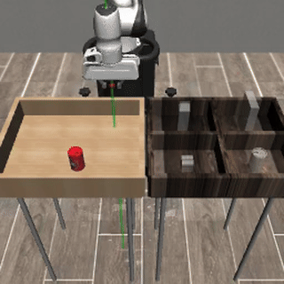

# Phase 5 — Can (PickPlaceCan) : tâche plus dure + virage transférabilité réel

> Après Lift (résolu + compressé à ~99 %), on étend à une tâche **pick-and-place** plus longue : attraper une canette et la déposer dans un bac. Au fil de la phase, **un constat majeur a fait pivoter le projet** : tous nos résultats donnaient les **coordonnées de l'objet** au modèle — une info qu'un vrai bras n'a pas. On a donc basculé en **vision pure** (image + proprio uniquement), seule voie crédible pour le bras 5 axes visé.
> Liens : [◀ Phase 4 Compression](COMPRESSION.md) · **Phase 5 (ici)** · [index](README.md)

## Contexte

**Robomimic Can / `PickPlaceCan`** : le bras Panda saisit une canette sur une table et la **dépose dans le bon compartiment** d'un bac — saisie **+ transport + dépôt** (vs Lift = juste soulever). ~2× plus d'étapes, horizon doublé (démos ~118 steps vs 59).

Dataset : **200 démos humaines** (ph), action 7D, image agentview 96px.

⚠️ **Single-object, pas du tri.** Le bac a 4 compartiments car la scène est héritée de la tâche complète **PickPlace** (canette, lait, céréales, pain → 4 bacs). `PickPlaceCan` n'en garde **qu'un** (la canette, toujours vers son compartiment ; les 3 autres restent vides). Le tri 4 objets n'est pas dispo en démos humaines dans Robomimic.

## Le parcours

| Étape | État |
|---|---|
| 1. Télécharger Can ph + convertir → LeRobot (12D avec can_pos) | ✅ |
| 2. Baseline (mini-CNN [64,128,256] + état 12D avec coords canette) | ✅ → **48 %** |
| 3. **Réalisation clé** : `can_pos` est une béquille sim indisponible au réel | 💡 |
| 4. **Vision pure** : converter `--proprio` → état 9D (sans can_pos) | ✅ |
| 5. Mono-cam agentview (ResNet18 + [64,128,256] + 9D) | ✅ → **72 %** (70 % @500) |
| 6. Diagnostic des échecs → ambiguïté de profondeur d'une seule vue | 💡 |
| 7. 2 cams (agentview + wrist), encodeur **partagé** | ✅ → **45 %** @500 (régression) |
| 8. 2 cams (agentview + wrist), encodeurs **séparés** | ✅ → **55 %** @500 |
| 9. Même chose, U-Net plus gros `[128,256,512]` (40 M) | ✅ → 68 % (50 val) |
| 10. **Wrist SEULE** (mono-cam wrist) — test de contrôle | ✅ → **0 %** ⚠️ |
| 11. Diagnostic : la wrist est OOD dès la 1ère erreur d'action | 💡 |
| 12. 2 cams (agentview + **birdview** scene-fixée) | ✅ → **74.8 %** @500 🎯 |

## Résultats

### Baseline (12D avec `can_pos`) — 48 %
Compressé `[64,128,256]` mini-CNN, 12k steps, état 12D incluant la position absolue de la canette. **48 % [35-62]** sur 50 val @ 10 pas. Can est apprenable mais pas résolu — la tâche est plus dure que Lift, ou le modèle est sous-dimensionné, ou l'état trop minimal.

### Pivot : pourquoi pas de coords objet
**Un vrai bras 5 axes n'aura JAMAIS la position de la canette donnée gratuitement** — il faudrait un système de perception pour la calculer depuis la caméra. Si on s'appuie sur cette béquille en sim, **rien ne transfère**. Le seul setup honnête côté transfert :
- **Image** (caméra réelle) + **proprioception** (encodeurs articulaires + cinématique).
- **Pas de pose objet** dans l'état.

Donc on rebascule en 9D (proprio seul) et on laisse la vision faire le travail de localisation.

### Mono-caméra vision-only (`02_proprio`) — **72 %**
ResNet18 (11.2 M) + U-Net `[64,128,256]` (5 M) + état 9D, 10k steps. **72 % [58-83]** sur 50 val @ 10 pas, t_succ 107. Can est résoluble en vision pure à un niveau utile.

Plot loss train/val : [`../results/runs/can/02_proprio/loss_curve.png`](../results/runs/can/02_proprio/loss_curve.png) (convergence propre, pas d'overfit).

### Diagnostic des échecs → ambiguïté de profondeur
Sur les ~28 % d'échecs, un pattern frappant : **le bras part vers les bacs sans avoir vraiment saisi la canette**. Avec une seule vue de face (agentview), le modèle a du mal à évaluer **où exactement** est la canette en profondeur.

Exemple typique (ep161 du modèle `02_proprio`) :

→ Sur les 300 steps disponibles, le bras n'arrive jamais à un grasp propre. C'est exactement le genre d'échec qu'une **2e vue** est censée corriger.

### 2 cams (agentview + wrist), encodeur partagé (`06_proprio_wrist`) — **45 %** @500
Ajout de `robot0_eye_in_hand` (vue du poignet), mêmes 9D + ResNet18 **partagé** entre les 2 vues, 10k steps. **45.0 % [40.7-49.4]** sur 500 rollouts — **régression franche** vs mono-cam (70 %), IC disjoints.

Hypothèse initiale : un seul ResNet18 doit gérer 2 distributions visuelles très différentes (vue large vs plongée poignet), il fait un **compromis qui dilue la capacité**.

### 2 cams, encodeurs séparés (`08_proprio_wrist_sep`) — **55 %** @500
1 ResNet18 par caméra (22.4 M de vision au lieu de 11.2), même U-Net `[64,128,256]`, 10k steps. **55.2 % [50.8-59.5]** sur 500 rollouts — meilleur que partagé (+10 pt, IC disjoints) mais **toujours en dessous** du mono-cam (-15 pt, IC disjoints).

Donc l'hypothèse « partager le backbone dilue » est validée partiellement, mais elle n'explique pas tout : même avec capacité doublée et encodeurs spécialisés, le 2-cams reste sous le mono-cam.

### U-Net plus gros `[128,256,512]` (`14_proprio_wrist_sep_big`) — 68 % (50 val)
Mêmes 2 cams séparés, U-Net **8× plus gros** (40 M de paramètres) pour exclure l'hypothèse « le débruiteur sature ». 10k steps + démarrage à chaud depuis `08`. **68 % [54-79]** sur 50 val — **récupère 12 pt** par rapport à `08`, mais reste **sous** le mono-cam à 11.2 M+5 M.

→ Augmenter brutalement la capacité ne suffit pas à compenser. Le problème est ailleurs.

### Wrist SEULE (`15_proprio_wristonly`) — **0 %** ⚠️
Même archi que `02_proprio` (ResNet18 + `[64,128,256]` + 9D), juste avec `robot0_eye_in_hand` à la place d'agentview. Expérience de contrôle. **0/50 réussites.**

Diagnostic : la wrist est **fragile à toute erreur d'action**. Dès le 1er pas où l'action prédite dévie un peu, le poignet bouge → le pixel d'entrée devient **out-of-distribution** vs les démos expertes → l'action suivante dévie plus → cascade. La wrist seule n'a aucun ancrage scène-fixe pour se rattraper.

→ La wrist **ne porte pas d'info sur la scène en propre** — elle n'est utile que **conditionnellement** à la trajectoire experte. Quand le multi-cam mélange wrist + agentview, la branche wrist **introduit du bruit OOD** au lieu d'apporter de la parallaxe utile.

### 2 cams (agentview + birdview) (`16_proprio_birdview`) — **74.8 %** 🎯
Même archi que `08` (2 cams séparés + 9D + `[64,128,256]`), mais **birdview** (vue de dessus, scene-fixée) au lieu de wrist. 50 val : 80 % [67-89]. **500 rollouts : 374/500 = 74.8 % [70.8 - 78.4]**, t_succ médian 110 steps, best ckpt 10000.

→ **+4.4 pt vs mono-cam (70.4 %), +19.6 pt vs `08` (wrist sep, 55.2 %).** Confirmation propre que c'est **spécifiquement la wrist** le problème : avec une 2ᵉ caméra scene-fixée, la parallaxe est exploitable et améliore la mono-cam.

> 📊 IC95 birdview [70.8, 78.4] chevauche **légèrement** mono-cam [66.3, 74.2]. Test z bilatéral à 2 proportions : z = 1.56, **p ≈ 0.12** → tendance forte mais pas formellement significatif à p<0.05. Les 500 rollouts étant **appariés** (mêmes 500 états initiaux), un test de McNemar serait plus puissant — non calculé ici car le script ne dump pas les rollouts par-épisode. L'écart vs `08` (wrist) est en revanche **sans ambiguïté** (IC complètement disjoints).

### 💡 Note théorique : un minimum local de la loss BC
Observation importante issue de cette série : le modèle 2-cams (`08`, 55 %) est **strictement plus expressif** que le mono-cam (`02`, 70 %). Il suffirait de mettre à zéro tous les poids du 2ᵉ encodeur et du canal d'entrée associé du U-Net pour récupérer exactement le mono-cam.

Donc :
- Il **existe** dans l'espace des paramètres de `08` une configuration ≥ 70 %.
- Pourtant SGD/Adam converge vers une solution à 55 %.
- → preuve empirique que l'optimisation tombe dans un **minimum local** de la loss BC plutôt que dans le minimum global.

Phase future à inscrire au backlog — **« optimisation de l'optimisation »** : comment forcer une architecture étendue à au moins égaler sa sous-architecture. Pistes :
- Initialiser le 2ᵉ encodeur (et son canal d'entrée U-Net) à zéro → warm-start identité mono-cam, la branche supplémentaire ne peut qu'aider.
- Entraînement **curriculum** : d'abord mono-cam jusqu'à convergence, puis dégeler la 2ᵉ branche.
- **Distillation** depuis le mono-cam comme garde-fou.
- **Gating** apprenable par caméra, dropout par caméra à l'entraînement.

## Leçons clés

1. **Donner les coords d'un objet en sim = béquille sans transfert au réel.** Tout score obtenu avec une telle béquille **n'est pas comparable** à ce qu'un vrai bras pourra faire. L'expérience honnête est image + proprio seul.
2. **Lift se résout très bien en vision pure** (~99 % avec coords → ~81 % sans, sur 500 rollouts). Can est plus dur : **70.4 %** @500 en mono-cam, **74.8 %** @500 en agentview+birdview (sep encoders).
3. **Une seule vue de face = ambiguïté de profondeur** sur les tâches de manipulation. Diagnostic empirique sur les échecs Can mono-cam.
4. **Le choix du 2ᵉ angle est critique.** Wrist (vue embarquée) = **piège OOD** (fragile aux moindres déviations d'action). Birdview (scene-fixée, parallaxe vraie) = gain modéré mais réel (+4.4 pt @500, p ≈ 0.12).
5. **Le multi-cam wrist régresse même avec encodeurs séparés et capacité ×4** — la cause n'est pas la dilution de capacité, c'est l'OOD intrinsèque de la wrist.
6. **Un modèle plus expressif peut converger en dessous de sa sous-architecture** (cf. note théorique : `08` à 55 % alors qu'il contient `02` à 70 % comme cas particulier). Sujet ouvert pour une phase future « optimisation de l'optimisation ».

## Détails techniques

- **Pipeline conversion** : `src/can_to_lerobot.py` avec flags mutuellement exclusifs `--wrist` (agentview + `robot0_eye_in_hand`), `--wrist-only` (mono-cam wrist), `--birdview` (agentview + `birdview`). Multi-cam = convention `observation.images.<nom>` (détectée par Diffusion Policy comme VISUAL multiples). Caméras disponibles sur PickPlaceCan : `agentview`, `frontview`, `birdview`, `robot0_robotview`, `robot0_eye_in_hand` (pas de `sideview`).
- **Éval** : `src/can_eval.py` (env PickPlaceCan, `make_env`, `load_init_states`, `MAX_STEPS=300`). État construit côté live env (`object[7:10]` pour `can_pos` quand utilisé) — différent de la convention dataset (`object[0:3]`) à cause du mismatch robosuite 1.4 ↔ 1.5.
- **Risque connu (résolu)** : robosuite 1.5 réordonne l'`object` et la partie relative est instable → solution = **abandonner la partie relative** et utiliser seulement les composantes fiables (proprio ± can_pos absolue).
- **Données** : `data_cache/robomimic_can_ph/` (HDF5 source), `data_cache/lerobot_can_ph[_proprio][_wrist|_wristonly|_birdview]/` (datasets convertis), `data_cache/can_demos/` (vidéos d'exemples expertes).
- **Scripts numérotés** : `01_train_baseline.sh` · `02_train_proprio.sh` · `03_eval_proprio.py` · `04/05_proprio_videos*.py` · `06_train_proprio_wrist.sh` · `07_eval_proprio_wrist.py` · `08_train_proprio_wrist_sep.sh` · `10_vision_500_rollouts.py` · `12_wrist_sep_videos_fail.py` · `14_train_proprio_wrist_sep_big.sh` · `15_train_proprio_wristonly.sh` · `16_train_proprio_birdview.sh` · `17_eval_proprio_birdview.py`.

## Suite

- **Phase 6 (théorique)** : « optimisation de l'optimisation » — warm-start identité, curriculum mono→multi, gating par caméra, distillation. Sujet motivé par `08` (55 %) ⊂ `02` (70 %) — un cas d'école de minimum local sur du BC. La prochaine campagne grand-format devra **dumper les rollouts par-épisode** pour permettre les tests appariés (McNemar) — sans ça, +4 pt avec n=500 reste sur p ≈ 0.12.
- Paliers plus durs en réserve : **Square** (insertion précise — données téléchargées) ou **Tool Hang** (très long horizon).
