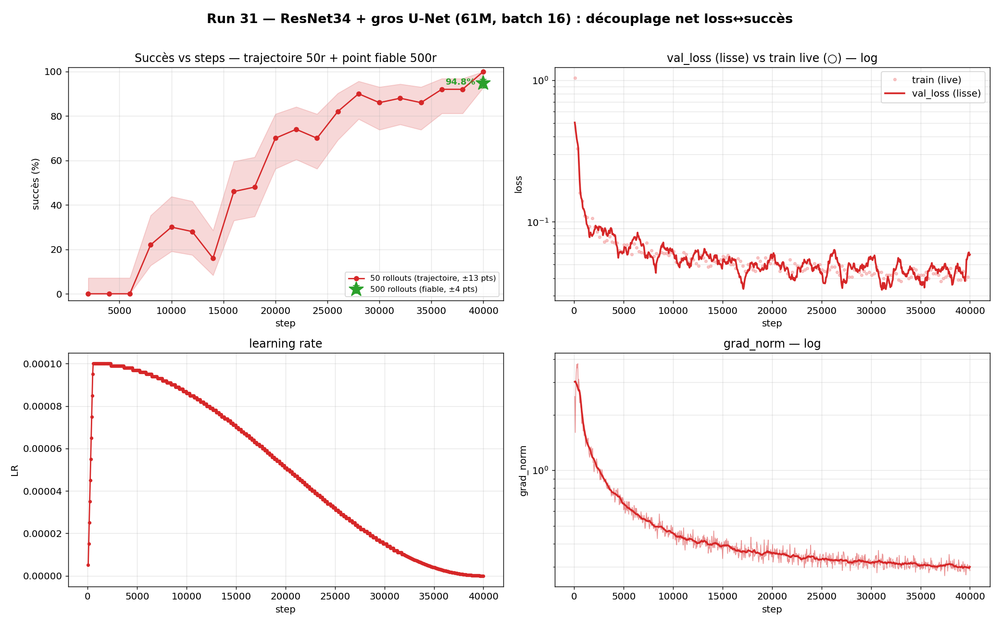

# Phase 5 — Can : le plafond venait de la **capacité**, pas de la vision pure

> Sur Can (pick-and-place dur), en **vision pure** (sans jamais donner les coordonnées de l'objet), le succès semblait bloqué à **~75 %**. On montre que ce plafond n'était **pas** une limite de la vision pure : c'était la **capacité du modèle**. En cumulant plus de vision (ResNet34) et plus de décodeur (gros U-Net), on passe de **~75 % à 94,8 %@500** — toujours sans coordonnées d'objet.

## Contexte

Can est plus dure que Lift (saisir + transporter + déposer). La v1 (démarrée avec les **coordonnées de l'objet** en entrée) est archivée → [`CAN_archive.md`](CAN_archive.md). Ici on travaille en **vision pure** : entrées = **images + proprioception**, **PAS** la pose de l'objet (`observation.state` 9D *sans* `can_pos`, vs 12D *avec*). C'est le réglage transférable vers un vrai robot, qui n'a pas la pose 3D de l'objet « gratuitement ».

Question : les leçons de compression/capacité de Lift généralisent-elles à cette tâche dure ?

## Le classement vision pure (500 rollouts, IC95 Wilson)

Mesure fiable (500 rollouts, ±~4 pts — le 50-rollouts était inutilisable, cf. [`METHODOLOGIE.md`](METHODOLOGIE.md)) :

| Run | Caméras | Backbone (encodeur) | U-Net | Params | Succès @500 |
|---|---|---|---|---|---|
| `06` | agentview + wrist | R18 **partagé** | [64,128,256] | 17 M | 45,0 % |
| `08` | agentview + wrist | R18 **séparé** | [64,128,256] | 28 M | 55,2 % |
| `02` | agentview seule | R18 | [64,128,256] | 16 M | 70,4 % |
| `16` | agentview + **birdview** | R18 séparé | [64,128,256] | 28 M | 74,8 % |

Deux constats : **le point de vue compte plus qu'une caméra de plus** (birdview 74,8 % ≫ wrist 55 %), et **encodeurs séparés > partagé** (55 % vs 45 %). Mais tout plafonne vers **~75 %**.

## L'hypothèse : le plafond = la capacité

Tous ces runs partagent le **même petit U-Net [64,128,256]** — exactement la taille qui bridait le Lift vision pure à ~81 % avant qu'un gros U-Net ne le débloque à ~99 % (cf. [`COMPRESSION.md`](COMPRESSION.md), [`CONVERGENCE.md`](CONVERGENCE.md)). On teste donc **deux axes de capacité** :

- **Vision** — ResNet18 → **ResNet34** (`26`) : **81,4 %@500** (+6,6 pts vs `16`). La vision était un goulot.
- **Décodeur** — gros U-Net [128,256,512] sur R18 (`25`) : **82 %@50** (checkpoints perdus → pas de mesure @500, mais l'indice est net).
- **Les deux cumulés** — ResNet34 + gros U-Net (`31`, **61 M**) : **94,8 %@500** [92,5–96,4].

## Résultat phare

| Modèle vision pure | Params | Succès @500 |
|---|---|---|
| `02` R18 mono-cam | 16 M | 70,4 % |
| `16` R18 birdview | 28 M | 74,8 % |
| `26` **R34** birdview | 48 M | 81,4 % |
| **`31` R34 + gros U-Net** birdview | **61 M** | **94,8 %** |

> **De « bloqué à ~75 % » à 94,8 %@500 — uniquement en ajoutant de la capacité (vision + décodeur), sans jamais donner les coordonnées de l'objet.** Le plafond n'était pas la vision pure ; c'était la taille du modèle. Les deux axes paient et **se cumulent**.

## Leçons clés
1. **Le plafond vision pure venait de la CAPACITÉ**, pas de l'absence de coordonnées d'objet.
2. **Vision (R18→R34) et décodeur (U-Net ×3) paient tous deux, et se cumulent** (94,8 % > 81,4 % > 74,8 %).
3. **Point de vue > nombre de caméras** (birdview ≫ wrist) ; **encodeurs séparés > partagé**.
4. **Mesurer à 500 rollouts** : le 86 %@50 du ResNet34 était optimiste → **81,4 %@500** réel.

## Détails techniques & caveats
- **Falaise mémoire** : le 61 M tient à **batch 16** sur M1/16 Go (batch 32 → swap). cf. [`PERF_TEMPS_ENTRAINEMENT.md`](PERF_TEMPS_ENTRAINEMENT.md).
- **Confond de budget cosine** : le 94,8 % est la **fin d'un cosine 40k** — on ne peut pas affirmer que c'est le plafond absolu (un cosine plus long « finirait » plus loin). On entraîne désormais en **LR constant** ; test de confirmation à faire. cf. [`METHODOLOGIE.md`](METHODOLOGIE.md).
- **`run 25`** (axe décodeur seul) : checkpoints supprimés → pas de mesure @500, seulement 82 %@50.

## Suite
- **Robustesse caméra** du 61 M (augmentation caméra) → casser le plafond camshift (cf. [`CAMERA.md`](CAMERA.md)).
- **Commande moteur** (articulaire) : le 61 M est-il aussi bon en espace **joints** qu'en cartésien ? (en cours).
- **Test LR constant** du 61 M pour lever le confond cosine (94,8 % est-il dépassable ?).
