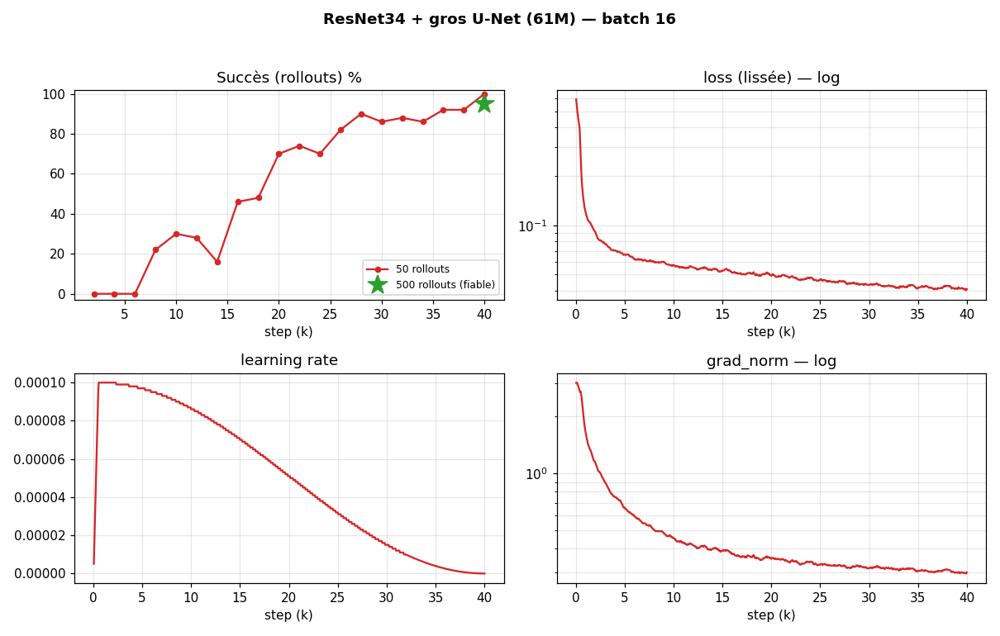
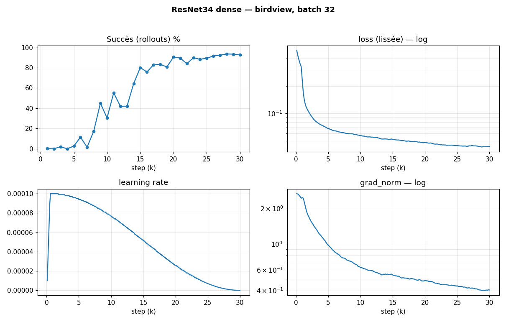
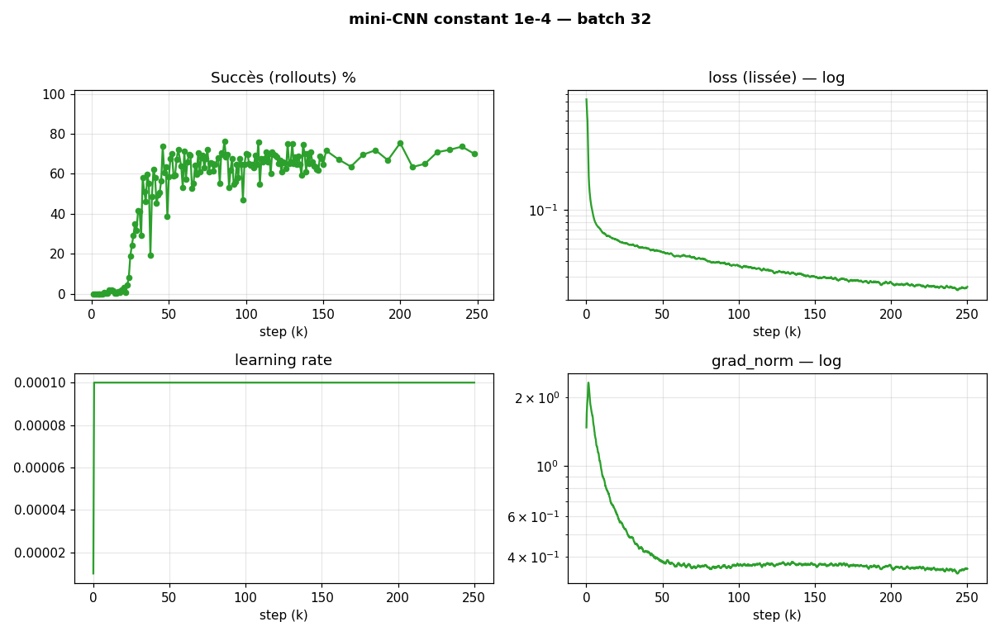
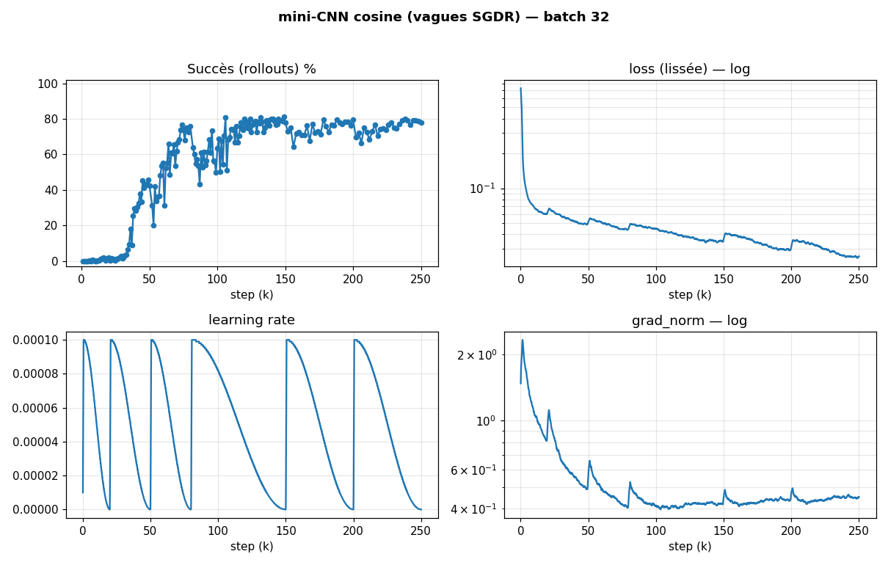

# Convergence — succès (rollouts) vs steps d'entraînement

**Question :** à quelle vitesse un modèle atteint-il sa performance réelle, et comment
la **capacité** change-t-elle cette vitesse ? On mesure la convergence sur le **vrai
signal** (taux de succès en rollouts), pas sur la val_loss.

## Règle de l'étude

Référence = **500 rollouts** par checkpoint (IC95 ≈ ±4 pts). Le **50 rollouts**
(IC95 ≈ ±13 pts) est accepté comme **provisoire** (tracé en pointillés) — utile pour
voir vite la forme, à repasser en 500 plus tard sur les checkpoints clés. Pour un même
run, le 500r prime sur le 50r. Sont exclus :
- les évals **camshift / camaug** (succès sous caméra décalée = autre mesure) ;
- les évals à un seul checkpoint (pas une trajectoire).

## Auto-extensible — comment ajouter un modèle

Le script `experiments/phase5_methodology/33_plot_convergence_rollouts.py`
**découvre seul** tous les `**/*rollouts_500.csv` sous `results/runs/`, recolle les
fragments d'un même run (suffixes `_continue`/`_resume`/`_150k`/`_200k`/…) et exclut
le camshift.

> **Pour ajouter un entraînement à l'étude :** produire un
> `results/runs/<…>/<run>/rollouts_500.csv` (colonnes `step,success_rate,…`) à
> checkpoints réguliers, puis **relancer le script**. La courbe et le tableau
> (`convergence_metrics.md`) se régénèrent. Un nouveau run inconnu apparaît
> automatiquement sous son nom (ajouter un libellé lisible dans `LABELS` si besoin).
>
> ⚠️ Une éval **mono-checkpoint** (type `vision_500.json`, un seul step) **ne nourrit
> pas** cette étude : il faut des rollouts à *plusieurs* steps réguliers.

Sorties : `results/runs/phase5_methodology/convergence_rollouts.png` et
`…/convergence_metrics.md`.

> ⚠️ **Consigne permanente** : **tout nouveau run entraîné avec des rollouts réguliers doit rejoindre cette étude.** Après l'entraînement → produire `rollouts_500.csv` (ou `rollouts_50.csv` provisoire) → relancer `33_plot_convergence_rollouts.py` (graphe global) **et** `34_plot_full_per_model.py` (graphe individuel). C'est une règle de travail tenue dans la durée (mémoire `feedback_convergence_study`).

## Résultats actuels

**Unité des colonnes = steps**, où **1 step = 1 batch = une mise à jour de poids**. ⚠️ Le **batch diffère selon les runs** → un step n'est pas la même quantité de données partout :

| run | batch | rollouts | plafond | décollage (>5 %) | 50 % du max | 90 % du max |
|---|---|---|---|---|---|---|
| ResNet34 + gros U-Net (run 31) | **16** | 50 (prov.) — 500 : **94,8 %** au best | 100 %@50 | 8 000 | 20 000 | **28 000** |
| ResNet34 dense | **32** | 500 | 94 % | 6 000 | 11 000 | **20 000** |
| mini-CNN cosine | **32** | 500 | 81 % | 34 000 | 45 000 | **73 000** |
| mini-CNN constant | **32** | 500 | 76 % | 24 000 | 30 000 | **46 000** |

> ⚠️ **Steps ≠ exemples vus** entre batchs différents : run 31 (batch **16**) voit **2× moins d'exemples par step** que les autres (batch 32). En *exemples vus*, son décollage est ~2× plus précoce que ses steps ne le suggèrent. Pour comparer à budget de données égal, raisonner en `step × batch`.

### Un graphe par modèle (succès · loss · learning rate · grad_norm)

 

 

*(Sur les quatre : la loss et le grad_norm sont au plancher bien avant que le succès ne décolle — cf. leçon 3.)*

## Leçons

1. **La capacité accélère ET relève la convergence du succès.** Le gros modèle atteint
   90 % de son max à **20k steps / plafond 94 %** ; le mini-CNN met **46–73k steps**
   pour plafonner **15–18 pts plus bas**. Plus de capacité = converge plus vite *et*
   plus haut (régime non sur-appris).
2. **La courbe de succès est une sigmoïde** : phase latente quasi-nulle → décollage
   brutal → plateau. Rien à voir avec la décroissance lisse de la loss.
3. **Le décollage du succès arrive bien après la convergence de la loss** (loss 90 %-
   convergée vers 750–6000 steps, succès qui décolle à 6–34k). → La val_loss est un
   mauvais chronomètre de convergence ; **seul le rollout** dit quand le modèle marche.
   (Cohérent avec [`PHASE5_PROTOCOLE.md`](PHASE5_PROTOCOLE.md) et [`CAMERA.md`](CAMERA.md).)
4. **Schedule** : `cosine` plafonne plus haut (81 % vs 76 %) mais converge plus lentement
   (90 %-max à 73k vs 46k) ; `constant` est plus rapide mais plafonne plus bas.

---
*Généré le 2026-06-22, mis à jour 2026-06-23 (run 31, unités/batch, graphes par modèle). Régénérer après chaque nouveau run à rollouts réguliers (`33_` + `34_`).*
