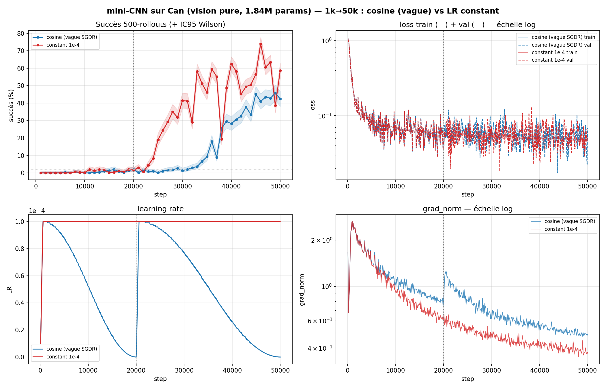
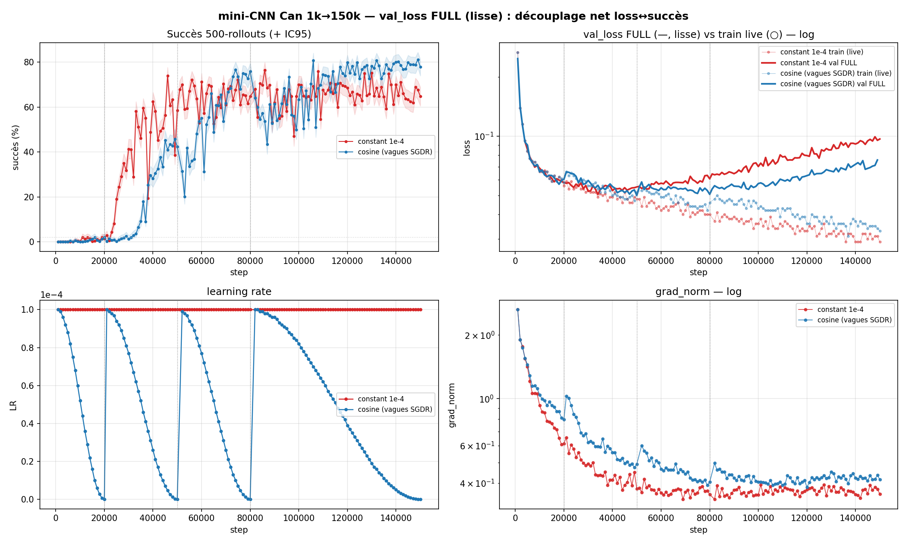

# Phase 5 — Méthodologie : peut-on faire confiance à nos mesures ?

> Sur une tâche dure (Can, vision pure), le **succès par checkpoint est très bruité**. Ce récit établit **comment évaluer et converger proprement** : combien de rollouts, pourquoi on ne peut pas interpoler, pourquoi une loss basse ne veut pas dire « fini », et si l'on peut décider « le modèle est bon » **sans simulation** (réponse : non, et c'est démontré).

## Contexte

En Lift (phase 3-4) le succès était propre et la compression facile à mesurer. Sur **Can** (pick-and-place, vision pure), les courbes de succès **dentellent** violemment d'un checkpoint à l'autre. Avant de conclure quoi que ce soit sur la capacité ou le schedule, il fallait répondre à une question préalable : **nos mesures sont-elles fiables, et que disent-elles vraiment ?**

---

## 1. Combien de rollouts ? — l'intervalle de confiance

On utilise partout l'**IC95 % de Wilson** (robuste près de 0/1, contrairement à Wald).

> **IC95 %** = l'ensemble des valeurs du paramètre **compatibles** avec les données de l'échantillon. Une valeur est « incompatible » si, pour cette valeur, la probabilité d'observer les données obtenues serait faible (→ le « 95 % »).

Ici le paramètre = la **vraie probabilité de succès** `p` (celle qu'on mesurerait avec un nombre infini de rollouts). Sur `N` rollouts :

- largeur de l'IC ∝ **1/√N** → pour diviser l'incertitude par 2, il faut **×4 rollouts** ;
- à p≈30 % : **±12,7 pts à N=50** → **±4,0 pts à N=500** ;
- à p≈90 % (plateau) : **±2,6 pts à N=500**.

> **50 rollouts (±~13 pts) ne permettent PAS de choisir un checkpoint ; 500 rollouts (±~4 pts), oui.** C'est la mesure de référence de toute la phase.

---

## 2. Le succès n'est pas lisse — interpoler est INVALIDE

Deux phénomènes distincts se cumulent dans la dentelure :

- **(a) Bruit de mesure** (N fini) : chaque point 50-rollouts a un IC95 de ±~10-13 pts.
- **(b) Instabilité RÉELLE du modèle** (au-delà du bruit) : entre checkpoints 500 **voisins** (1000 steps), |Δsuccès| médian 3 pts mais **jusqu'à 28 pts**, et **10/29 écarts dépassent 8 pts** (> 2× l'IC95 à N=500) → vraies différences de modèle.

**Conséquence — interpoler entre points 500 est invalide.** La droite reliant deux points 500 consécutifs, évaluée aux steps intermédiaires, **sort de l'IC95 du point réel dans 28 % des cas** (vs ~5 % attendu si l'interpolation était valide). Le trait qui relie les points est un **artefact visuel, pas une trajectoire**.

> **« Convergé » = une bande, pas une valeur.** À partir de ~20k : succès ∈ [~84 %, ~94 %] ; un checkpoint pris seul peut être à l'un ou l'autre bout.

**L'instabilité ne se lisse à aucune échelle** (figure `courbe_finevar_57k.png`) :
- zoom **100 steps** (10k-11k, chacun 500 rollouts) : succès oscille **24 % → 57 %** (amplitude 33 pts) ;
- zoom **10 steps** (fenêtre jamais entraînée, chacun 500 rollouts) : **encore ~33 pts** d'amplitude, sauts de −15/−16 pts entre voisins distants de **10 pas de gradient**, 8/20 écarts à IC95 disjoints.

![Variance fine : 1 checkpoint tous les 10 pas sur [57000,57200], 500 rollouts chacun](../results/runs/phase5_methodology/courbe_finevar_57k.png)

> Chaque point = un checkpoint distant de **10 pas de gradient**, évalué à **500 rollouts** (bande = IC95). Le succès saute de 42 % à 75 % sur 200 pas, avec des IC95 **disjoints** entre voisins → ce sont de **vraies différences de modèle**, pas du bruit. La « courbe » qui relie les points n'est qu'un artefact visuel.

Et c'est **découplé de tous les signaux d'entraînement** : dans ces zones, train/val loss plate (~0,05), learning rate lisse, grad_norm plat (~0,62) — rien ne bouge pendant que le succès zigzague de 33 pts. C'est une **sensibilité intrinsèque** du succès (fonction non-lisse des poids en boucle fermée) aux micro-changements de poids, pas un artefact du LR.

→ **On n'évalue que le checkpoint EXACT qu'on déploiera. Pas d'interpolation, pas de confiance au voisinage.**

---

## 3. Loss au plancher ≠ « convergé »

Expérience décisive (mini-CNN 1,84 M params, Can vision pure ; figure `courbes_minicnn_full_1k_50k.png`). Deux runs entraînés à l'identique jusqu'à 20k, **loss train ET val au plancher ~0,05 dès ~5k**, succès **~2 %**. Conclusion naïve : « modèle trop faible, convergé à 2 % ». **FAUX.**

Le run cosine avait **annealé son LR à ~2e-9 (≈ 0) à 20k** → poids gelés, succès figé à 2 % alors que la loss *paraissait* parfaite. En prolongeant 20k→50k :
- **LR constant 1e-4** : succès **2 % → 74 %** ;
- **cosine (warm restart SGDR)** : 2 % → 46 % (sa redescente de LR ré-affame le modèle).

> *Haut-droite* : train **et** val loss au **plancher dès ~5k**. *Haut-gauche* : pourtant le succès reste à **~2 %** jusqu'à 20k, puis décolle vers **74 %** (constant) une fois prolongé. *Bas-gauche* : le cosine d'origine avait annealé son LR à ~0 à 20k → poids gelés. La loss était **aveugle à +72 points** de succès récupérables.

> Le mini-CNN n'était **pas trop faible** : il était **affamé de LR**. La loss était **aveugle à +72 points** de capacité réelle. **Ne jamais arrêter un entraînement sur la loss.** Et **surveiller le LR de fin** : un scheduler qui anneal à ~0 gèle le modèle bien avant son potentiel (détail : [`SCHEDULE.md`](SCHEDULE.md) ; convergence : [`CONVERGENCE.md`](CONVERGENCE.md)).

### Conséquence — on entraîne désormais en LR **constant**

Le cosine pose un **confond de budget** : en annealant le LR à ~0 à l'horizon choisi, il « dépose » le modèle à cet horizon → il **paraît convergé à N steps, quel que soit N**. Le point d'arrivée est **imposé par le budget choisi, pas révélé par le modèle**. *(Exemple : `run 31` — ResNet34 + gros U-Net — atteint 94,8 %@500 à la fin d'un cosine 40k, mais on **ne peut pas** en conclure que c'est son plafond : un cosine 80k « finirait » à 80k, un cosine 20k à 20k, et chacun semblerait « fini ».)*

**Décision : entraîner en LR constant.** Le cosine peut grappiller un pic légèrement plus haut, **mais** le LR constant :
- permet de **s'arrêter quand le succès plafonne** (on surveille succès + `grad_norm` et on coupe quand ça n'avance plus) ;
- **élimine les deux inconnues** — durée d'entraînement et taille du cosine — qu'on ne peut pas deviner a priori.

C'est décisif **pour le vrai robot** : on ne peut pas relancer l'entraînement avec plusieurs horizons de cosine pour trouver le bon. Le LR constant laisse entraîner **jusqu'au plateau, puis stopper** — sans pari sur la durée.

---

## 4. Quand arrêter SANS simulation ?

La sim coûte cher. Peut-on décider « fini / bon » avec des mesures **sans rollout** ? On a passé en revue tous les signaux offline. **Réponse : aucun n'est fiable seul**, mais ils échouent pour des raisons instructives.

> **Tout est sur cette figure.** *Haut-gauche* : le succès (500 rollouts) monte et tient. *Haut-droite* : la **val_loss full décolle** (monte fortement) — signature de manuel du surapprentissage — **alors que le succès ne baisse pas** → ce n'est PAS du surapprentissage, et la loss ne dit **rien** du niveau de succès. *Bas-droite* : le **grad_norm** plafonne ≈ au moment où le réseau a fini d'apprendre — le seul signal d'entraînement qui marque un « quand ».

### Signaux d'entraînement classiques
- **Niveau de loss (train/val)** — INUTILISABLE : au plancher dès ~5k alors que le succès grimpe jusqu'à 150k. La val_loss *full* est même en **U** (minimum ~50k puis remonte) → s'arrêter à son minimum raterait tout le reste.
- **Écart val − train** (l'indicateur « manuel » du surapprentissage) — INUTILISABLE : dans le plateau, train↓ (0,044→0,029) et val↑ (0,058→0,097), écart ×5 = **signature de manuel du surapprentissage**… alors que le **succès ne bouge pas** (et le cosine *s'améliore*). **Fausse alarme.**
- **grad_norm** — le MOINS mauvais : son plateau borne le **QUAND** (poids stabilisés ⇒ succès stabilisé *en moyenne*), mais il est **aveugle au NIVEAU** (~0,35 que le succès soit 53 % ou 74 %). Il répond « a-t-il fini d'apprendre ? », pas « est-il bon ? ».

### Proxies d'action dédiés (forward passes, sans sim)
| métrique | constant (full / plateau) | cosine (full / plateau) |
|---|---|---|
| MSE de la prédiction moyenne | 0,39 / 0,33 | 0,51 / 0,59 |
| couverture par état | 0,46 / 0,37 | 0,29 / **0,74** |
| MMD marginal | **0,67** / 0,43 | 0,50 / 0,42 |

Aucun ne tient : la **MSE moyenne** punit la multimodalité (moyenner « gauche » et « droite » = « tout droit », faux pour les deux) ; le **compounding** ne se mesure qu'en teacher-forcing (aveugle à la dérive boucle-fermée, faudrait un world-model) ; le **MMD marginal** est une version bruitée du grad_norm ; la **couverture par état** *remonte* dans le plateau → conclurait « il mémorise » À TORT.

### Pourquoi TOUTES nos métriques crient « surapprentissage » à tort — le mode-averaging
La tâche est **multimodale** (plusieurs actions valides par image) mais chaque démo n'enregistre **qu'un** choix, et toutes les métriques mesurent la distance à **cette action unique**. Le sens des métriques **s'inverse** au fil de l'entraînement :
- tôt : modèle *flou* → prédit une moyenne hésitante proche de n'importe quelle démo → **val basse**, mais action indécise → **échoue** ;
- tard : modèle *engagé* sur un mode valide → s'éloigne du choix arbitraire des démos held-out → **val haute**, mais action décisive → **réussit**.

→ La métrique confond « le modèle a choisi un AUTRE mode valide » avec « il a mémorisé ». Le mur est fondamental : avec **une seule action par état**, on ne peut PAS distinguer les deux.

**Preuve que ce n'est PAS du surapprentissage : le réseau ne PEUT pas mémoriser** (mécanismes vérifiés dans la config) — objectif **DDPM** (cible bruitée à un timestep aléatoire → jamais la même entrée deux fois), **capacité minuscule** (1,84 M), **bottleneck spatial-softmax** (32 keypoints), weight decay. Empiriquement : sur 1k→250k, train↓/val↑ continuent **sans** que le succès se dégrade — un vrai surapprentissage ferait chuter le succès.

> **Bilan : `grad_norm` pour « quand arrêter » (borne le *quand*), rollouts pour « est-ce bon » (rien ne borne le *combien* sans sim). Aucun proxy d'action testé ne remplace le rollout.**

---

## 5. État de l'art — évaluation/sélection offline (2023-2026)

Recherche dédiée et vérifiée (détail complet : [`recherche/eval_offline.md`](recherche/eval_offline.md)). Points saillants :

- **Un théorème** [Simchowitz 2025] : tout imitateur **lisse et déterministe** subit une erreur boucle-fermée **exponentielle en horizon** → une faible erreur offline **ne borne pas** l'erreur réelle. Échappatoires : politiques **stochastiques/non-lisses** (← la diffusion) et données expertes bien étalées. (Robomimic : *« the best validation policy is 50 to 100 % worse than the best policy »*.)
- **Les ensembles ne marchent pas en multimodal** (variance ≈ OOD aux points multimodaux) [Diff-DAgger].
- **Meilleur signal sans-rollout** : incertitude par la **loss de diffusion** (quantile ~95 % du train) → +39 % F1 vs ensembles, *mais validé OnLine/OOD, pas pour la sélection de checkpoint*.
- **La vraie réponse du domaine = hybride** : OPE (FQE/model-based, benchmark DOPE — aucun n'atteint l'oracle) + **budget minimal de rollouts** choisis par **A-OPS** + comparaison **STEP** (−40 % d'essais). On ne **supprime** pas les rollouts, on les **réduit**.

---

## Leçons clés

1. **500 rollouts**, pas 50 — l'IC95 de Wilson (±4 pts) encadre alors la vraie valeur.
2. **Évaluer le checkpoint exact** : l'instabilité du succès est réelle et **ne se lisse à aucune échelle** (33 pts d'amplitude à 100 pas comme à 10 pas). Pas d'interpolation.
3. **Loss au plancher ≠ convergé** : un mini-CNN « loss parfaite, 2 % » cachait 72 points récupérables par simple LR soutenu.
4. **Tout signal qui monte sur le val** (val_loss, écart val-train, couverture) **crie « surapprentissage » à tort** — il mesure la fidélité aux démos, pas la réussite. Artefact **mode-averaging**, pas mémorisation.
5. **`grad_norm` = quand ; rollouts = combien.** Aucun proxy offline ne décide « c'est bon » seul (mathématiquement établi).
6. **LR constant, pas cosine** : le cosine fait « paraître convergé » à l'horizon choisi (confond de budget). Le constant laisse s'arrêter au vrai plateau et supprime l'inconnue durée/taille-de-cosine — crucial sur robot réel.

## Suite / pistes
- **Entraînements futurs en LR constant** + arrêt au plateau (succès stabilisé / `grad_norm` plat), au lieu d'un cosine à horizon deviné.
- Vérifier si le plafond de `run 31` (94,8 %@500, cosine 40k) **monte encore** en LR constant prolongé — confond de budget non encore levé.
- **Hybride A-OPS + STEP** pour un bras réel (démos seules) : pré-filtre par incertitude de loss de diffusion, puis budget minimal de rollouts réels.
- **World-model** depuis les démos pour capturer la dérive boucle-fermée (faisabilité non prouvée à ce jour).

## Volet caméra / sim-to-real
La fragilité au déplacement de caméra (effondrement de 74 % → 13 % dès 2 cm/2°) et l'augmentation caméra constituent désormais la **Phase 6** → [`CAMERA.md`](CAMERA.md).

---
*Figures : `results/runs/phase5_methodology/` (`courbes_methodo.png`, `courbe_finevar_57k.png`, `courbes_minicnn_full_1k_50k.png`, `courbes_minicnn_valfull_1k_150k.png`, `courbe_coverage.png`). Sources offline : `docs/recherche/eval_offline.md`.*
