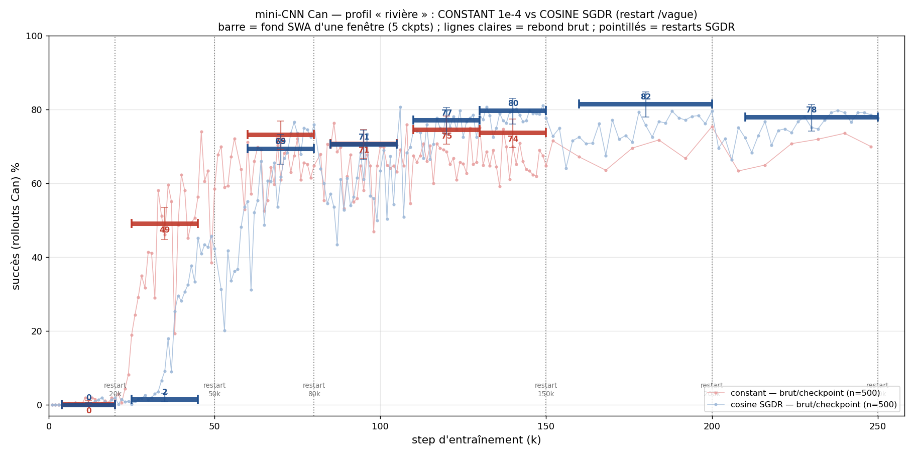
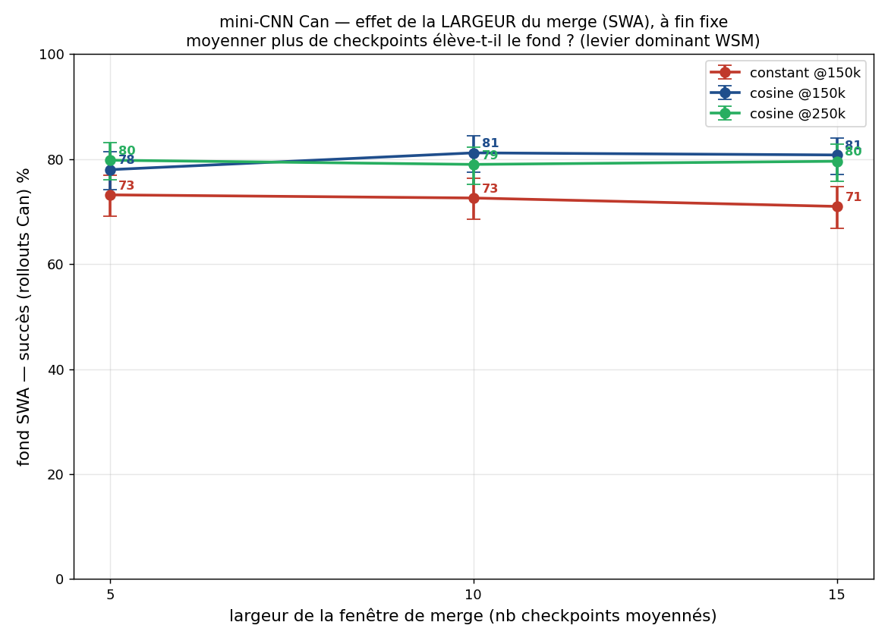

# Rivière mini-CNN Can — LR constant vs cosine SGDR

Profil « rivière-vallée » appliqué au **mini-CNN sur Can** (2 M params, vision pure, rollouts n=500).
On compare deux planifications de learning rate poussées loin :

- **constant 1e-4** (pas d'annealing) — checkpoints 0→150k
- **cosine SGDR** (vagues avec restart aux bornes 20/50/80/150/200/250k) — checkpoints 0→264k

**Méthode.** À chaque position d'entraînement, on moyenne les poids de 5 checkpoints (SWA) et on évalue
ce modèle moyenné par rollouts (n=500). Ce « fond SWA » mesure la position du fond de la vallée de perte
le long de la « rivière ». Scripts : `experiments/phase5_methodology/33_river_minicnn_cos_vs_const.sh`,
tracés `34_plot_river_minicnn.py` / `35_plot_windowsize_minicnn.py`.

## Graphes

## Résultats (fond SWA, fenêtres 5 checkpoints, n=500)

| zone | constant | cosine SGDR |
|---|---|---|
| 4-20k (très précoce) | 0 | 0 |
| 25-45k | **49** | **2** ← *milieu de vague* |
| 60-80k | 73 | 69 |
| 85-105k | 71 | 71 |
| 110-130k | 75 | 77 |
| 130-150k (fin de vague) | 74 | **80** |
| 160-200k (fin de vague) | — | 82 |
| 210-250k (fin de vague) | — | 78 |
| **plateau** | **~73 %** | **~80 %** |

## Trois conclusions

1. **Hypothèse rivière confirmée sur les deux runs.** Le LR (constant *ou* cosine) fait un **progrès
   global** : le fond SWA monte (0 → ~73 pour le constant, jusqu'à ~80 pour la cosine) puis **plafonne**.
   Pousser le LR constant plus loin n'élève plus le fond — c'est une impasse au-delà du plateau.

2. **La cosine SGDR se pose ~5-7 pts plus haut** (fins de vague ~78-82) que le plateau constant (~73-75).
   Les restarts aident un peu, mais **plafonnent ~80** (82→78 = bruit) : pas de montée infinie.

3. **Insight méthodo — le SWA/merge à travers une vague à fort LR est destructeur.**
   En plein milieu d'une vague cosine (25-45k, LR encore élevé), le fond SWA s'effondre à **2 %** :
   moyenner des checkpoints qui rebondissent encore (modèle à 25k ≠ modèle à 45k) casse tout.
   Le merge ne marche qu'aux **fins de vague** (LR→0) ou quand le modèle est déjà dans un bassin stable
   (vagues tardives, où même en mid-vague il tient ~71 %). → **La vraie perf cosine se lit sur le rebond
   brut, pas sur le fond SWA mid-vague.**

## Largeur de la fenêtre de merge (le « levier dominant » de WSM)

À fin fixe, on moyenne 5 / 10 / 15 checkpoints :

| ancrage | 5 ck | 10 ck | 15 ck |
|---|---|---|---|
| constant @150k | 73 | 73 | 71 |
| cosine @150k | 78 | **81** | 81 |
| cosine @250k | 80 | 79 | 80 |

→ **Chez nous, élargir le merge n'est PAS un levier fort.** Au mieux +3 pts (cosine @150k), et
**c'est dans le bruit** (IC95 ±4 à n=500). Ça **nuance WSM** (qui le présente comme dominant) :
le gain n'existe que s'il y a de la **diversité convergée** à moyenner (checkpoints divers *mais posés*,
au creux d'une vague cosine), pas sur un plateau constant homogène — et il reste marginal sur ce petit modèle.

## Lien

Étude sœur sur le joint (cooldown réel vs merge) : profil cooldown `cooldown_profile.png`, et `docs/SCHEDULE.md`
pour la synthèse LR (WSD / WSM / Schedule-Free).
