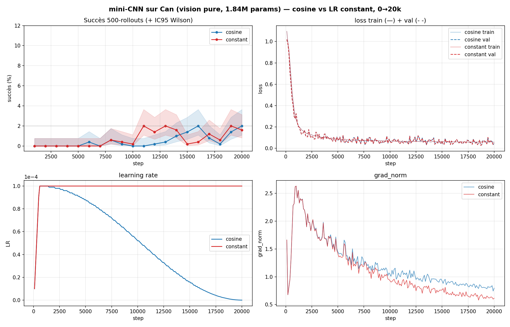

# Phase 5 — Schedule de learning rate : constant vs cosine

> Le schedule de LR décide **quand** le modèle décolle et **où** il plafonne. Constat central : un **cosine annealé à ~0 GÈLE le modèle** (faux plateau), alors que le **LR constant** débloque et permet de **s'arrêter au vrai plateau**. Bilan : on adopte le **LR constant**.

## Contexte

Banc d'essai : mini-CNN Can vision pure (1,84 M params), deux schedules comparés à l'identique :
- **constant** 1e-4 (LR plat),
- **cosine** en *vagues* (warm-restart SGDR : LR remonte puis redescend vers ~0 à chaque cycle).

## 1. Le piège : un cosine annealé à 0 = **faux plateau**

À 20k steps, les deux runs sont à **~2 % de succès**, **loss au plancher** (~0,05). Conclusion naïve : « modèle trop faible, convergé ». **Faux.**

*Bas-gauche : le cosine (bleu) a annealé son LR vers **~0** à 20k → poids sur le point de geler ; le constant (rouge) reste à **1e-4**. Haut-gauche : les deux à ~2 %, haut-droite : loss au plancher pour les deux.*

En **prolongeant 20k→50k** :
- **constant 1e-4** : succès **2 % → 74 %** ;
- **cosine-vague** : 2 % → **46 %** (sa redescente de LR **re-affame** le modèle).

→ Le succès à 20k n'était pas un plafond de capacité, c'était une **famine de LR** due à l'annealing. Un cosine qui finit à ~0 **dépose** le modèle à l'horizon choisi, qui **paraît donc convergé quel que soit l'horizon** (confond de budget, cf. [`METHODOLOGIE.md`](METHODOLOGIE.md)).

## 2. Long horizon : constant décolle plus tôt, cosine plafonne un peu plus haut

Sur 1k→250k (500 rollouts, cf. [`CONVERGENCE.md`](CONVERGENCE.md)) :

| Schedule | Décollage (50 % du max) | Plafond |
|---|---|---|
| **constant** | ~30k steps | **76 %** |
| **cosine** | ~45k steps | **81 %** |

→ Le cosine grappille **~5 pts** de plafond, mais converge **plus lentement** (90 % du max à 73k vs 46k pour le constant).

## 3. Extensions 80k→300k : ça sature, ça ne se dégrade **pas**

Au-delà de ~150k, les deux **saturent** (~76–81 %) ; les restarts cosine tous les 50k **maintiennent ~80 % sans gagner davantage**. Surtout : malgré `train↓ / val↑` (signature « manuel » du surapprentissage), **le succès ne chute jamais** → pas de vrai surapprentissage, juste un plateau (artefact mode-averaging, cf. [`METHODOLOGIE.md`](METHODOLOGIE.md)). Allonger l'entraînement ne casse rien ; ça ne fait que plafonner.

## Décision : on entraîne en LR **constant**

Le cosine peut grappiller un pic légèrement plus haut, **mais** le constant :
1. permet de **s'arrêter quand le succès plafonne** (on surveille succès + `grad_norm`, on coupe quand ça n'avance plus) ;
2. **supprime les deux inconnues** — durée d'entraînement et taille du cosine — qu'on ne peut pas deviner a priori.

C'est **décisif pour le vrai robot** : on ne peut pas relancer l'entraînement avec plusieurs horizons de cosine pour trouver le bon. Le constant laisse entraîner **jusqu'au plateau, puis stopper**, sans pari sur la durée.

## Leçons clés
1. **Ne jamais laisser le LR annealer à ~0** tant qu'on n'est pas sûr d'être au plafond — sinon **faux plateau** (un modèle « loss parfaite, 2 % » cachait +72 pts).
2. **Constant** = décollage plus tôt, simple, **stoppable au plateau**. **Cosine** = pic un peu plus haut, mais **budget à deviner**.
3. **Allonger l'horizon ne dégrade pas le succès** (pas de vrai surapprentissage) ; ça plafonne.

## Suite
- Vérifier sur les **gros modèles** que le constant atteint le plafond du cosine (run 31 = 94,8 % en cosine 40k → tester en constant prolongé, cf. [`CAN.md`](CAN.md)).

---
*Figures : `results/runs/phase5_methodology/` (`courbes_minicnn_cos_vs_const.png`, `courbes_minicnn_full_1k_150k.png`, `courbes_minicnn_valfull_1k_150k.png`).*
