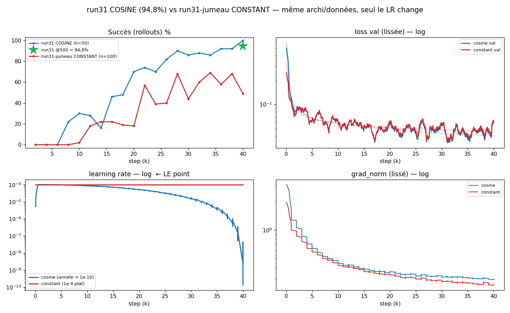

# Phase 5 — Schedule de learning rate : constant vs cosine

> Le schedule de LR décide **quand** le modèle décolle et **où** il plafonne. Constat central : un **cosine annealé à ~0 GÈLE le modèle** (faux plateau), alors que le **LR constant** débloque et permet de **s'arrêter au vrai plateau**. Bilan : on adopte le **LR constant**.

## Contexte

Banc d'essai : mini-CNN Can vision pure (1,84 M params), deux schedules comparés à l'identique :
- **constant** 1e-4 (LR plat),
- **cosine** en *vagues* (warm-restart SGDR : LR remonte puis redescend vers ~0 à chaque cycle).

## 1. Le piège : un cosine annealé à 0 = **faux plateau**

À 20k steps, les deux runs sont à **~2 % de succès**, **loss au plancher** (~0,05). Conclusion naïve : « modèle trop faible, convergé ». **Faux.**

*Bas-gauche : le cosine (bleu) a annealé son LR vers **~0** à 20k → poids sur le point de geler ; le constant (rouge) reste à **1e-4**. Haut-gauche : les deux à ~2 %, haut-droite : loss au plancher pour les deux.*

En **prolongeant 20k→50k** :
- **constant 1e-4** : succès **2 % → 74 %** ;
- **cosine-vague** : 2 % → **46 %** (sa redescente de LR **re-affame** le modèle).

→ Le succès à 20k n'était pas un plafond de capacité, c'était une **famine de LR** due à l'annealing. Un cosine qui finit à ~0 **dépose** le modèle à l'horizon choisi, qui **paraît donc convergé quel que soit l'horizon** (confond de budget, cf. [`METHODOLOGIE.md`](METHODOLOGIE.md)).

## 2. Long horizon : constant décolle plus tôt, cosine plafonne un peu plus haut

Sur 1k→250k (500 rollouts, cf. [`CONVERGENCE.md`](CONVERGENCE.md)) :

| Schedule | Décollage (50 % du max) | Plafond |
|---|---|---|
| **constant** | ~30k steps | **76 %** |
| **cosine** | ~45k steps | **81 %** |

→ Le cosine grappille **~5 pts** de plafond, mais converge **plus lentement** (90 % du max à 73k vs 46k pour le constant).

## 3. Extensions 80k→300k : ça sature, ça ne se dégrade **pas**

Au-delà de ~150k, les deux **saturent** (~76–81 %) ; les restarts cosine tous les 50k **maintiennent ~80 % sans gagner davantage**. Surtout : malgré `train↓ / val↑` (signature « manuel » du surapprentissage), **le succès ne chute jamais** → pas de vrai surapprentissage, juste un plateau (artefact mode-averaging, cf. [`METHODOLOGIE.md`](METHODOLOGIE.md)). Allonger l'entraînement ne casse rien ; ça ne fait que plafonner.

## Décision : on entraîne en LR **constant**

Le cosine peut grappiller un pic légèrement plus haut, **mais** le constant :
1. permet de **s'arrêter quand le succès plafonne** (on surveille succès + `grad_norm`, on coupe quand ça n'avance plus) ;
2. **supprime les deux inconnues** — durée d'entraînement et taille du cosine — qu'on ne peut pas deviner a priori.

C'est **décisif pour le vrai robot** : on ne peut pas relancer l'entraînement avec plusieurs horizons de cosine pour trouver le bon. Le constant laisse entraîner **jusqu'au plateau, puis stopper**, sans pari sur la durée.

## Leçons clés
1. **Ne jamais laisser le LR annealer à ~0** tant qu'on n'est pas sûr d'être au plafond — sinon **faux plateau** (un modèle « loss parfaite, 2 % » cachait +72 pts).
2. **Constant** = décollage plus tôt, simple, **stoppable au plateau**. **Cosine** = pic un peu plus haut, mais **budget à deviner**.
3. **Allonger l'horizon ne dégrade pas le succès** (pas de vrai surapprentissage) ; ça plafonne.

## Suite — ✅ run31 COSINE vs run31-jumeau CONSTANT (mesure directe, même archi/données)

Trois choses sautent aux yeux :
1. **Panneau LR = la seule vraie différence** : cosine annéle 1e-4 → **1e-10** ; constant reste **plat à 1e-4**.
2. **Loss val QUASI IDENTIQUES** (~0,04, superposées) → **la loss est aveugle à la différence** (« loss ≠ succès », cf. Robomimic).
3. **Succès = abîme** : cosine monte proprement vers **94,8 %** ; constant **oscille et plafonne ~50-69 %**, ne rejoint jamais le cosine.

→ À loss identique, l'**annealing du cosine "pose" le modèle** dans un bien meilleur minimum. Le **constant ne le fait pas seul** (non-posé) → c'est ce que le **SWA rattrape** (50→77), mais **partiellement** (résidu ~18 pts = sous-convergence, cf. [`ENSEMBLING_JOINT.md`](ENSEMBLING_JOINT.md)).

---

# Mise à jour 2026 — État de l'art LR (au-delà de cos vs constant) + spécificités imitation learning

> Synthèse de recherche (sources vérifiées). **Le débat n'est plus « cos vs constant » mais « comment se POSER » (settling)** ; et en **imitation learning** la contrainte dominante (loss≠succès) change tout.

## 1. WSD (Warmup-Stable-Decay) & le « river valley »
La réponse moderne (LLM, 2024-25) : **warmup → phase stable à LR constant (aussi longue qu'on veut) → court cooldown final (~10 % des steps) vers 0**. ≥ cosine en perf, **sans pari de budget**.
- **Mécanisme « river valley »** ([arXiv 2410.05192](https://arxiv.org/abs/2410.05192)) : en phase constante l'optimiseur **rebondit en travers de la vallée** (loss haute) mais **avance le long de la rivière** ; le cooldown **amortit le rebond → se pose au fond**. **On l'a confirmé empiriquement par les poids** : à steps égaux, le constant est **16× plus étalé** que le cosine (0,98 % vs 16 %).
- **Limites** : (a) on ne peut **pas juger la qualité avant de décroître** ; (b) hypothèse issue de la **stochasticité des tokens (LLM)** → transfert à la diffusion-policy **non garanti** ; (c) la forme du cooldown compte (sqrt/power/D2Z, [2508.01483](https://arxiv.org/pdf/2508.01483)). **Condition cachée** : la phase constante doit *réellement* faire progresser (à vérifier — test « profil rivière » : fond SWA par fenêtre).

## 2. Merge ≥ decay : WSM & Schedule-Free (= notre SWA)
- **WSM** ([2507.17634](https://arxiv.org/html/2507.17634)) : **remplace la décroissance par du merging de checkpoints**. Théorème : merger ≡ décroissance synthétique. **Bat WSD** (+3,5 % MATH, +5,5 % MMLU-Pro). **La DURÉE de la fenêtre de merge est le levier dominant** → explique notre `late10` (18k) = 88 % ≫ `late5` (8k) = 70 %. Poids uniformes ≈ décroissance linéaire ; poids dérivés (≈cosine) mieux ; **EMA-pour-le-merge = mauvais**. Merge et decay **ne se combinent pas**.
- **Schedule-Free** (Defazio, [2605.19095](https://arxiv.org/html/2605.19095)) : LR constant + averaging, **aucune décroissance**, bat cosine ET WSD à batch moyen.
→ **Notre SWA est dans cette famille SOTA**, pas un pis-aller.

## 3. ⭐ Spécificité IMITATION LEARNING — le plus important pour nous
L'IL = petits datasets, multi-époques, et surtout **objectif d'entraînement ≠ objectif d'éval**. L'étude **Robomimic** (sur notre tâche Can, [arXiv 2108.03298](https://arxiv.org/pdf/2108.03298)) :
- **La loss de validation n'est PAS la performance** : la policy « meilleure val » est **50-100 % PIRE** que la meilleure ; la val monte **pendant que le succès monte**. → **ne pas early-stop sur la loss ; entraîner long, sélectionner par ROLLOUT.**
- → **Annéler tôt = geler avant le pic de succès** (exactement notre mini-CNN gelé à 2 %). Le **constant ne gèle jamais → on ne rate pas le pic.** C'est une justification **IL-spécifique** de notre choix constant, indépendante de la théorie LLM.
- **L'instabilité des checkpoints** (notre joint 12-56 %) est un **phénomène connu et non résolu** en 2025-26 ; pratique standard = top-3 par rollout. **Notre SWA (moyenne de poids) = la version déployable** (un seul modèle robuste).
- **EMA** validé en Diffusion Policy (+5-10 %, régime from-scratch) ; LeRobot l'avait **retiré** → **réactivé** chez nous (`EMA=1`).

## 4. LR par composant (pour notre ResNet34 + U-Net, from scratch)
- **CNN from-scratch** : 1e-4→5e-4 ; **U-Net diffusion** : ~1e-4 → **plages qui se recouvrent → notre LR unique 1e-4 est bien fondé.**
- Le ratio **« encodeur 10× plus bas »** ne vaut **QUE pour un encodeur PRÉ-ENTRAÎNÉ** (le nôtre est random-init `pretrained_backbone_weights:null`). Levier futur : **ResNet34 pré-entraîné ImageNet** (taille exacte, dispo torchvision ; garder BatchNorm) → *alors* le 10:1 + recette DP (98 %) deviennent pertinents. cf. backlog.

## Recommandation affinée (remplace « on entraîne en constant » seul)
**LR constant (ne jamais geler avant le pic) + SWA/merge sur la queue (settling gratuit ; fenêtre large = le levier ; poids ≈cosine, PAS l'EMA pour le merge) + EMA pendant l'entraînement + sélection par ROLLOUT.** Cooldown WSD et merge sont **redondants** (ne pas combiner). Garde-fou : toute la théorie « settling » vient du LLM → **nos tests empiriques (profil rivière, matrice SWA) tranchent pour notre domaine.**

---
*Figures : `results/runs/phase5_methodology/` (`courbes_minicnn_cos_vs_const.png`, `courbes_minicnn_full_1k_150k.png`, `courbes_minicnn_valfull_1k_150k.png`). Sources LR : voir aussi [`ENSEMBLING_JOINT.md`](ENSEMBLING_JOINT.md).*
